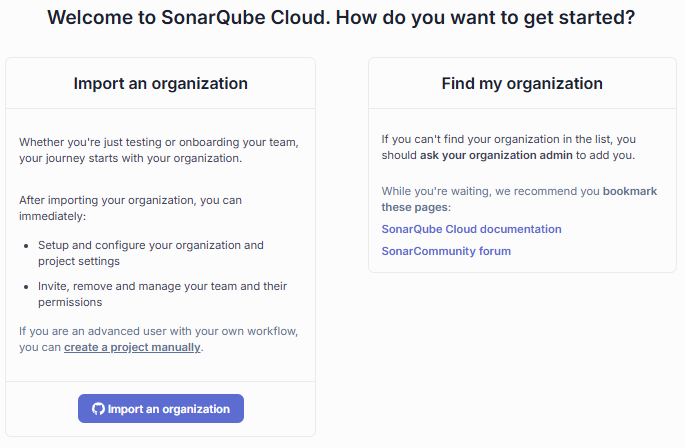
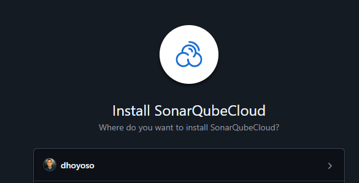
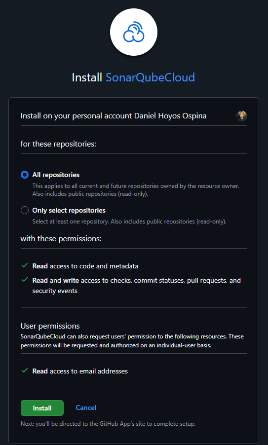
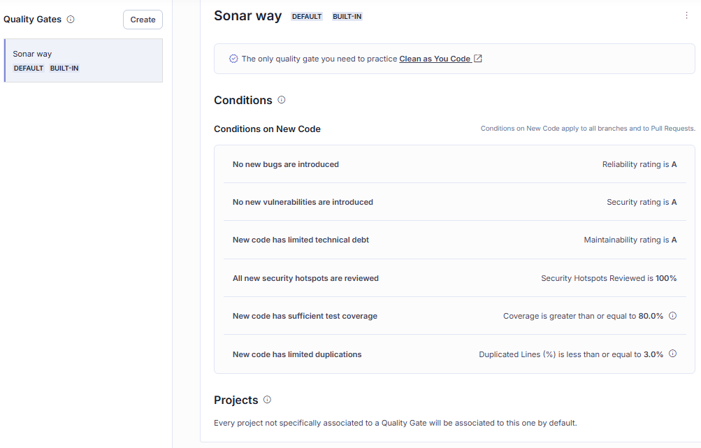
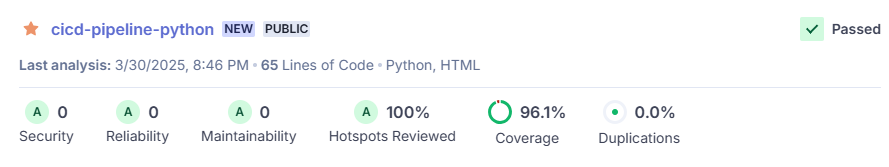

# Taller Grupal Entregable 2: Pipeline de CI con Python, GitHub Actions, Docker y Herramientas Open Source

En este taller construiremos un pipeline de Integración Continua (CI) para una aplicación Python simple, utilizando GitHub Actions, Docker y herramientas open source.  Aprenderás a:

*   Analizar la calidad y seguridad de tu código con Pylint, Flake8, Black y medir la cobertura con Coverage.py.
*   Integrar SonarCloud para análisis estático continuo, cobertura, seguridad y gates de calidad.
*   Escribir y ejecutar pruebas unitarias con pytest.
*   Automatizar pruebas de aceptación con Selenium y un headless browser.
*   Configurar un workflow de GitHub Actions que ejecute todas estas etapas en cada push.
*   Usar variables de entorno y secretos de forma segura.
*   Crear una imagen Docker para tu aplicación.
*   Automatizar la publicación de la imagen Docker en Docker Hub.


**Nota:** No realizaremos pruebas de integración y no crearemos un release de un artefacto tradicional (zip, tar, etc.). Sin embargo, al final del pipeline generaremos una imagen Docker que encapsula nuestra aplicación y sus dependencias. Esta imagen podrá ser utilizada para despliegues consistentes en diferentes entornos y será publicada en Docker Hub, un registro público de imágenes Docker. Este enfoque nos prepara para prácticas de despliegue modernas.

## 1. Introducción: ¿Qué es un Pipeline de CI?

Un pipeline de CI es un proceso automatizado que se ejecuta cada vez que se realizan cambios en el código de un repositorio.  Típicamente, un pipeline de CI incluye las siguientes etapas:

1.  **Code (Código):**  El desarrollador escribe código y lo sube al repositorio (usando Git, idealmente siguiendo un flujo de trabajo como Gitflow).

    **Gitflow** es un flujo de trabajo de Git que define una serie de ramas y reglas para gestionar el desarrollo de software de manera estructurada. Utiliza ramas principales como main y develop, y ramas de soporte como feature, release, y hotfix para organizar el trabajo en nuevas funcionalidades, preparaciones para lanzamientos y correcciones de errores críticos.

2.  **Build (Construcción):** Se compila el código (si es necesario), se instalan las dependencias y se prepara el entorno de ejecución. En Python, esta etapa a menudo implica crear un entorno virtual e instalar paquetes con `pip`. En este taller, también incluirá la construcción de una imagen Docker.

3.  **Test (Pruebas):**  Se ejecutan pruebas automatizadas para verificar que el código funciona correctamente y cumple con los requisitos de calidad.  Esto incluye:
    *   **Análisis de Calidad de Código:**  Herramientas que verifican el estilo del código, la complejidad, la presencia de errores potenciales, code smells y el cumplimiento de estándares (ej: PEP 8 en Python).
    *   **Pruebas Unitarias:**  Prueban unidades individuales de código (funciones, clases, métodos) de forma aislada.
    *   **Pruebas de Aceptación (o Pruebas Funcionales/ en algunos lugares también las usan para E2E):**  Prueban la aplicación desde la perspectiva del usuario, simulando interacciones reales, usualmente a través de la interfaz de usuario (UI).

4.  **Release (Liberación):** Si todas las pruebas pasan, el código se considera apto para ser liberado. En un entorno de *Integración Continua*, esta etapa puede ser una verificación o la creación de un artefacto listo para desplegar. En este taller, esta etapa consistirá en publicar la imagen Docker en Docker Hub.

## 2. Herramientas que Usaremos

*   **Python:**  Lenguaje de programación.
*   **GitHub Actions:**  Plataforma de CI/CD.
*   **Pylint:**  Analizador estático de código Python.  Detecta errores, problemas de estilo y código sospechoso.
*   **Flake8:**  Otra herramienta de análisis estático.  Combina PyFlakes (detección de errores lógicos), pycodestyle (verificación de estilo según PEP 8) y un detector de complejidad McCabe.
*   **Black:**  Formateador de código automático.  Aplica un estilo consistente a tu código.
*   **pytest:**  Framework para escribir y ejecutar pruebas unitarias.
*   **Coverage.py:** Mide la *cobertura de código* de tus pruebas unitarias (qué porcentaje de tu código está siendo ejecutado por las pruebas).
*   **Selenium:**  Framework para automatizar pruebas de aplicaciones web (pruebas de aceptación).  Permite simular la interacción de un usuario con un navegador.
    *   **Webdriver Manager:**  Simplifica la gestión de los drivers de navegador para Selenium.
*   **SonarCloud:**  Plataforma *online* gratuita (para proyectos open source) para inspección continua de la calidad del código.  Se integra con GitHub Actions.
*   **Flask:** Microframework web de Python (para crear una aplicación web sencilla de ejemplo).
* **Docker:** Plataforma para desarrollar, desplegar y ejecutar aplicaciones en contenedores.
* **Docker Hub:** Un servicio de registro basado en la nube para construir y compartir imágenes de contenedores.

## 3. Configuración del Proyecto

1.  **Crea un nuevo repositorio público en GitHub:**  Llámalo, por ejemplo, `cicd-pipeline-python`.

2.  **Clona el repositorio a tu máquina local**

3. **Crea un archivo `.gitignore` en la raíz de tu repositorio**:

    ```plaintext
    # virtual envs
    venv/
    env/

    # python
    *.pyc
    *.pyo
    *.pyd
    __pycache__/

    # pytest
    .pytest_cache/
    pytestdebug.log

    # coverage
    .coverage
    htmlcov/
    coverage.xml
    report.html
    acceptance_coverage.xml

    # IDE
    .vscode/
    ```

    Este archivo le dice a Git qué archivos y carpetas *no* debe incluir en el repositorio (por ejemplo, el entorno virtual, archivos de caché, archivos de configuración locales, etc.).

4.  **Crea un entorno virtual y activalo:**

    ```bash
    python -m venv venv      # En algunos SO puede ser python3
    # Si no funciona, instala virtualenv: pip install virtualenv y re-ejecuta.

    venv\Scripts\activate    # En Windows
    source venv/bin/activate # En Linux/macOS
    ```

    El entorno virtual aísla las dependencias del proyecto. Te debe aparecer `(venv)` en la terminal.

5. **Crea un archivo `requirements.txt` en la raíz de tu repositorio:**

    ```plaintext
    pylint
    flake8
    black
    pytest
    coverage
    selenium
    webdriver-manager
    flask
    pytest-cov
    pytest-html
    gunicorn
    ```

    Este archivo lista las dependencias de tu proyecto y sus versiones.

6.  **Instala las dependencias:**

    ```bash
    pip install -r requirements.txt
    ```
    En la misma terminal donde activaste el entorno virtual.

7.  **Crea un archivo `Dockerfile` en la raíz de tu repositorio:**
    Este archivo contiene las instrucciones para construir la imagen Docker de tu aplicación.

    ```dockerfile
    # Dockerfile
    # Usa una imagen base oficial de Python. Elige una versión específica para consistencia.
    FROM python:3.12-slim

    # Establece el directorio de trabajo dentro del contenedor
    WORKDIR /app

    # Copia solo el archivo de requerimientos primero para aprovechar el cache de Docker
    COPY requirements.txt .

    # Instala las dependencias definidas en requirements.txt
    # Usa --no-cache-dir para reducir el tamaño de la imagen
    RUN pip install --no-cache-dir -r requirements.txt

    # Copia el resto del código de la aplicación al directorio de trabajo
    COPY . .

    # Expón el puerto en el que Gunicorn servirá la aplicación
    # Gunicorn por defecto usa 8000, así que usaremos ese.
    EXPOSE 8000

    # Comando para ejecutar la aplicación usando Gunicorn cuando el contenedor inicie
    # 'app.app:app' significa: del archivo app.py dentro del paquete app, usa la instancia 'app' de Flask.
    # 'workers=4' es un ejemplo, ajusta según sea necesario.
    # 'bind 0.0.0.0:8000' hace que Gunicorn escuche en todas las interfaces de red en el puerto 8000.
    CMD ["gunicorn", "--workers=4", "--bind=0.0.0.0:8000", "app.app:app"]
    ```
    Investiga qué hace cada instrucción (`FROM`, `WORKDIR`, `COPY`, `RUN`, `EXPOSE`, `CMD`) y por qué el orden de las capas (`COPY requirements.txt` antes de `COPY . .`) es importante para la eficiencia de la construcción de la imagen.

8.  **Crea un archivo `.dockerignore` en la raíz de tu repositorio:**
    Similar a `.gitignore`, este archivo especifica qué archivos y directorios NO deben ser copiados a la imagen Docker durante el proceso de `COPY`.

    ```plaintext
    # .dockerignore
    .git
    .gitignore
    .dockerignore
    Dockerfile
    README.md
    venv
    env
    __pycache__
    *.pyc
    *.pyo
    *.pyd
    .pytest_cache
    htmlcov
    coverage.xml
    report.html
    acceptance_coverage.xml
    .vscode
    *.md
    Entregable2-images
    sonar-project.properties
    pytest.ini
    ```

### 3.1. Crea una cuenta en Docker Hub

Docker Hub es el registro de imágenes Docker más popular. Necesitarás una cuenta para poder publicar (hacer "push") tu imagen Docker creada por el pipeline de CI.


1.  **Ve a [https://hub.docker.com/](https://hub.docker.com/) y regístrate:** Haz clic en "Sign Up" y sigue las instrucciones. Necesitarás un nombre de usuario único (tu **Docker ID**), un correo electrónico y una contraseña.
2.  **Recuerda tu Docker ID:** Lo necesitarás más adelante para configurar los secretos en GitHub y para etiquetar tu imagen Docker.
3.  **Verifica tu correo electrónico:** Completa el proceso de verificación si Docker Hub te lo solicita.
4.  **Genera un Token de Acceso:** Para iniciar sesión desde GitHub Actions (o cualquier script automatizado), es una **mejor práctica** usar un token de acceso en lugar de tu contraseña.
    * Inicia sesión en Docker Hub.
    * Ve a tu "Account Settings".
    * Ve a la pestaña "Personal Access Tokens".
    * Haz clic en "Generate new token".
    * Dale un nombre descriptivo (ej: `github-actions-cicd-pipeline`).
    * Define los permisos (ej: "Read & Write").
    * Haz clic en "Generate".
    * **Copia el token inmediatamente.** No podrás verlo de nuevo.

## 4. La Aplicación de Ejemplo (Calculadora Web)

Crearemos una aplicación web muy sencilla con Flask (una calculadora) para tener algo que probar tanto a nivel unitario como a nivel de aceptación.

1.  **Crea una carpeta `app`**: Dentro de la carpeta raíz de tu proyecto (es decir `cicd-pipeline-python`)
2.  **Crea un archivo llamado `calculadora.py` dentro de la carpeta `app`**:

    ```python
    # app/calculadora.py
    def sumar(a, b):
        return a + b

    def restar(a, b):
        return a - b

    def multiplicar(a, b):
        return a * b

    def dividir(a, b):
        if b == 0:
            raise ZeroDivisionError("No se puede dividir por cero")
        return a / b
    ```
    Este archivo contiene las funciones de la calculadora.  Cada función toma dos números y realiza una operación matemática (suma, resta, multiplicación, división).  Si se intenta dividir por cero, se lanza una excepción `ZeroDivisionError`.

3.  **Crea un archivo `app.py` dentro de la carpeta `app`**:

    ```python
    # app/app.py
    from flask import Flask, render_template, request
    from .calculadora import sumar, restar, multiplicar, dividir

    app = Flask(__name__)

    @app.route("/", methods=["GET", "POST"])
    def index():
        resultado = None
        if request.method == "POST":
            try:
                num1 = float(request.form["num1"])
                num2 = float(request.form["num2"])
                operacion = request.form["operacion"]

                if operacion == "sumar":
                    resultado = sumar(num1, num2)
                elif operacion == "restar":
                    resultado = restar(num1, num2)
                elif operacion == "multiplicar":
                    resultado = multiplicar(num1, num2)
                elif operacion == "dividir":
                    resultado = dividir(num1, num2)
                else:
                    resultado = "Operación no válida"
            except ValueError:
                resultado = "Error: Introduce números válidos"
            except ZeroDivisionError:
                resultado = "Error: No se puede dividir por cero"

        return render_template("index.html", resultado=resultado)

    if __name__ == "__main__":
        app.run(debug=True, port=5000, host='0.0.0.0') # Quita debug=True para producción
    ```
    Este archivo contiene la lógica de la aplicación web.  La función `index` maneja las peticiones GET y POST en la ruta raíz (`/`).  Si la petición es un POST, intenta obtener los números y la operación del formulario y llama a las funciones de la calculadora.  Luego, renderiza la plantilla `index.html` con el resultado.

4.  **Crea una carpeta `templates` dentro de la carpeta `app`**

5.  **Crea un archivo `templates/index.html` dentro de la carpeta `templates`:**

    ```html
    <!DOCTYPE html>
    <html>
    <head>
        <title>Calculadora</title>
    </head>
    <body>
        <h1>Calculadora</h1>
        <form method="post">
            <input type="text" name="num1" placeholder="Número 1" required>
            <input type="text" name="num2" placeholder="Número 2" required>
            <select name="operacion">
                <option value="sumar">Sumar</option>
                <option value="restar">Restar</option>
                <option value="multiplicar">Multiplicar</option>
                <option value="dividir">Dividir</option>
            </select>
            <button type="submit">Calcular</button>
        </form>
        
            <h2>Resultado: {{ resultado }}</h2>
        
    </body>
    </html>
    ```
    Este archivo es una plantilla HTML simple que muestra un formulario con dos campos de entrada (números) y un menú desplegable (operación).  Al enviar el formulario, muestra el resultado de la operación.

6.  **Crea un archivo `__init__.py` dentro de la carpeta `app`**:

    ```python
    # app/__init__.py
    # Archivo vacío para marcar 'app' como un paquete Python
    ```

7.  **Ejecuta la aplicación Flask (localmente para probar):**
    Parado en la raíz de tu repositorio, ejecuta:

    ```bash
    python -m app.app # en algunos SO, es python3 -m app.app
    ```

    Abre tu navegador y ve a [http://localhost:5000](http://localhost:5000).  Deberías ver la calculadora web.  Prueba a hacer algunas operaciones para asegurarte de que funciona correctamente.

    *Nota:*  Para detener la aplicación Flask, presiona `Ctrl+C` en la terminal.

### 4.1. Construcción y Prueba Local de la Imagen Docker

Antes de configurar el pipeline de CI completo, es una buena práctica verificar que tu `Dockerfile` funciona correctamente y que la aplicación se ejecuta como se espera dentro del contenedor Docker.

**Asegúrate de tener Docker Desktop (o Docker Engine) instalado y en ejecución en tu máquina.**

1.  **Construye la imagen Docker localmente:**
    Abre tu terminal en la raíz del proyecto (donde están tu `Dockerfile` y la carpeta `app`) y ejecuta el siguiente comando:

    ```bash
    docker build -t mi-calculadora-local .
    ```
    * `docker build`: El comando para construir una imagen Docker.
    * `-t mi-calculadora-local`: La opción `-t` (tag) asigna un nombre y, opcionalmente, una etiqueta a la imagen. Aquí la llamamos `mi-calculadora-local` (puedes elegir otro nombre).
    * `.`: El punto al final indica que el contexto de construcción (los archivos necesarios para construir la imagen, incluyendo el `Dockerfile`) se encuentra en el directorio actual.

    Docker ejecutará los pasos definidos en tu `Dockerfile`, descargando la imagen base, instalando dependencias y copiando tu código.

    Si quieres ver las imágenes que has construido, puedes ejecutar:

    ```bash
    docker images
    ```

2.  **Ejecuta un contenedor a partir de la imagen:**
    Una vez construida la imagen, puedes crear y ejecutar un contenedor basado en ella:

    ```bash
    docker run -d --name calculadora-container -p 8080:8000 mi-calculadora-local
    ```
    * `docker run`: El comando para ejecutar un contenedor a partir de una imagen.
    * `-d`: (Detached) Ejecuta el contenedor en segundo plano, liberando tu terminal.
    * `--name calculadora-container`: Asigna un nombre fácil de recordar al contenedor en ejecución (`calculadora-container`). Esto facilita la gestión posterior (parar, eliminar, ver logs).
    * `-p 8080:8000`: (Publish) Mapea un puerto de tu máquina local (host) al puerto expuesto por el contenedor.
        * `8080`: El puerto en tu máquina local al que accederás (puedes usar otro si el 8080 está ocupado).
        * `8000`: El puerto *dentro* del contenedor que `gunicorn` está usando (según lo definido en el `EXPOSE` y `CMD` del `Dockerfile`).
    * `mi-calculadora-local`: El nombre de la imagen que construiste en el paso anterior y desde la cual quieres crear el contenedor.

3.  **Verifica la aplicación en el navegador:**
    Abre tu navegador web y navega a `http://localhost:8080` (o el puerto que hayas elegido en el `-p`). Deberías ver tu aplicación de calculadora funcionando exactamente igual que cuando la ejecutaste con `python -m app.app`, pero esta vez está corriendo dentro de un contenedor Docker aislado. Realiza algunas operaciones para confirmar que todo funciona.

4.  **Detén y elimina el contenedor (limpieza):**
    Cuando hayas terminado de probar, es bueno detener y eliminar el contenedor para liberar recursos:

    ```bash
    docker stop calculadora-container
    docker rm calculadora-container
    ```
    * `docker stop`: Detiene el contenedor especificado por su nombre.
    * `docker rm`: Elimina el contenedor detenido especificado por su nombre.

    Este ciclo de construir, ejecutar y probar localmente te permite depurar tu `Dockerfile` y asegurarte de que tu aplicación está correctamente empaquetada antes de integrarla en el pipeline de CI/CD.


## 5. Análisis de Calidad de Código

### 5.1. Pylint, Flake8 y Black (Local)

1.  **Ejecuta Pylint:**

    ```bash
    pylint app --fail-under=9
    ```

    Verás un informe con los problemas encontrados (si los hay) y una puntuación.  Presta atención a los errores (E), warnings (W), convenciones (C) y refactorizaciones (R).
    Según la configuración por defecto, Pylint considera que una puntuación de 9 o superior es aceptable. Si la puntuación es inferior, el comando fallará (en el pipeline de CI, esto detendría el proceso).
    No corrijas aún los problemas, solo observa el informe.

2.  **Ejecuta Flake8:**

    ```bash
    flake8 app
    ```

    Flake8 mostrará errores de estilo (según PEP 8) y otros problemas de calidad de código.  Presta atención a los errores. No corrijas aún los problemas, solo observa el informe.

3.  **Ejecuta Black:**

    ```bash
    black app
    ```

    Black reformateará tu código automáticamente para que cumpla con un estilo consistente.  Después de ejecutar Black, vuelve a ejecutar Pylint y Flake8 para ver si los problemas de estilo han desaparecido. ¿Algunos desaparecieron? y ¿la puntuación de pylint subió? ¿verdad?, Black es una herramienta muy útil para mantener un estilo de código consistente.

    No corrijas aún el resto de problemas, solo observa el informe.

    *Importante:*  Es una buena práctica ejecutar estas herramientas *antes* de hacer un commit. Así te aseguras de que tu código cumple con los estándares de calidad y estilo, evitando con antelación que el pipeline de CI falle.

### 5.2. Integración con SonarCloud (Análisis Estático Continuo)

SonarCloud es una plataforma en la nube que proporciona análisis estático continuo de código.  Es gratuita para proyectos de código abierto y se integra muy bien con GitHub Actions.
La idea con esta herramienta es que puedas tener un análisis continuo de la calidad de tu código, detectando problemas de seguridad, bugs, code smells y duplicación de código.
SonarCloud tomará los informes de Pylint, Flake8 y Coverage.py y los mostrará en un panel de control fácil de entender.

1.  **Crea una cuenta en SonarCloud:**  Ve a [https://sonarcloud.io/](https://sonarcloud.io/) y regístrate con tu cuenta de GitHub.
2.  **Crea una organización:** 
    * Da click en "Import an organization".


    
    * Luego selecciona tu cuenta de Github. 


    
    * Selecciona All repositories y da click en "Install".


    
    * Crea tu organización (nombre e identificador único), selecciona el plan gratuito y da click en **crear** organización. **Recuerda el nombre de tu organización (Key), lo necesitarás más adelante.**

3.  **Importa tu repositorio:**
    *   Haz clic  'My Projects' y selecciona "Analyze a new project".
    *   Selecciona tu repositorio (`cicd-pipeline-python`) y dale click en `Set Up`.
    *   Elige "Number of days", elige "30" con el fin de analizar todo el código que sea ha escrito en los últimos 30 días en tu repositorio.
    *   SonarCloud analizará tu repositorio y te mostrará un panel de control con los resultados.  Inicialmente, puede que no muestre mucha información porque no hemos configurado el análisis en el workflow.
4.  **Obtén tu token de SonarCloud:**
    *   Ve a "My Account" (en la esquina superior derecha).
    *   Ve a la pestaña "Security".
    *   Genera un token (dale un nombre, por ejemplo, "GitHub Actions Token").  *Copia este token*.  Lo necesitarás más adelante.
5.  **Crea los secretos en GitHub:**
    *   Ve a tu repositorio en GitHub (`cicd-pipeline-python`) > Settings > Secrets and variables > Actions > New repository secret.
    * Crea *cuatro* secretos:
        * **`SONAR_TOKEN`:** Pega el token que copiaste de SonarCloud.
        * **`SONAR_HOST_URL`:** Pon `https://sonarcloud.io`.
        * **`DOCKERHUB_USERNAME`:** Pon tu **Docker ID**.
        * **`DOCKERHUB_TOKEN`:** Pega el **Token de Acceso** que generaste en Docker Hub.

6.  **Crea un archivo `sonar-project.properties` en la raíz de tu repositorio:** Este archivo le dice a SonarCloud cómo analizar tu proyecto.

    ```properties
    sonar.projectKey=[TU_USUARIO]_cicd-pipeline-python
    sonar.organization=[TU_ORGANIZACION]
    sonar.sources=app
    sonar.python.version=3.12
    sonar.python.pylint.reportPaths=pylint-report.txt
    sonar.python.flake8.reportPaths=flake8-report.txt
    sonar.coverage.exclusions=**/tests/**,**/setup.py,app/__init__.py
    sonar.python.coverage.reportPaths=coverage.xml
    sonar.qualitygate.wait=true
    sonar.qualitygate.timeout=300
    ```
     **Importante:**
    *   Reemplaza `[TU_USUARIO]` con tu *nombre de usuario de GitHub*. **Si tu repositorio no se llama `cicd-pipeline-python`, reemplaza también `cicd-pipeline-python` con el nombre de tu repositorio o proyecto en SonarCloud**
    *   Reemplaza `[TU_ORGANIZACION]` con el *nombre o Key de tu organización en SonarCloud* (que puede ser diferente a tu nombre de usuario de GitHub, pero **USUALMENTE es el mismo usuario de Github si no cambiaste nada al crear la organización en SonarCloud**).
    *   `sonar.sources=app`:  Esto le dice a SonarCloud que solo analice el código dentro de la carpeta `app`.  Si tuvieras código en otros directorios, los añadirías aquí (separados por comas).
    *   `sonar.python.version=3.12`:  Indica la versión de Python que estás utilizando.
    *   `sonar.python.pylint.reportPaths=pylint-report.txt`:  Le dice a SonarCloud dónde encontrar el informe de Pylint.
    *   `sonar.python.flake8.reportPaths=flake8-report.txt`:  Le dice a SonarCloud dónde encontrar el informe de Flake8.
    *   `sonar.coverage.exclusions=**/tests/**,**/setup.py,app/__init__.py`:  Excluye los archivos de prueba, el init y el archivo `setup.py` de la cobertura de código.
    *   `sonar.python.coverage.reportPaths=coverage.xml`:  Le dice a SonarCloud dónde encontrar el informe de cobertura de código.
    *   `sonar.qualitygate.wait=true`:  Espera a que se complete el análisis antes de aplicar el Quality Gate. El quality gate es un conjunto de condiciones que tu código debe cumplir para ser considerado "bueno" (por ejemplo, un mínimo de cobertura de código, un máximo de errores, etc.). Si no se cumple el Quality Gate, el análisis fallará. El quality gate que tenemos establecido es el por defecto de SonarCloud:
    
    *   `sonar.qualitygate.timeout=300`:  Tiempo máximo de espera para el Quality Gate (en segundos).

## 6. Pruebas Unitarias con pytest y Cobertura

1.  Crea un directorio llamado `tests` en la raíz de tu proyecto.

2.  Dentro de `tests`, crea un archivo llamado `test_calculadora.py`:

    ```python
    # tests/test_calculadora.py
    import pytest
    from app.calculadora import sumar, restar, multiplicar, dividir

    def test_sumar():
        assert sumar(2, 3) == 5
        assert sumar(-1, 1) == 0
        assert sumar(0, 0) == 0

    def test_restar():
        assert restar(5, 2) == 3
        assert restar(1, -1) == 2
        assert restar(0, 0) == 0

    def test_multiplicar():
        assert multiplicar(2, 3) == 6
        assert multiplicar(-1, 5) == -5
        assert multiplicar(0, 10) == 0

    def test_dividir():
        assert dividir(10, 2) == 5.0
        assert dividir(5, -1) == -5.0
        with pytest.raises(ZeroDivisionError):
            dividir(1, 0)
    ```

    Estas pruebas unitarias verifican que las funciones de la calculadora (`sumar`, `restar`, `multiplicar`, `dividir`) funcionen correctamente.  Cada prueba verifica varios casos (números positivos, negativos, cero, división por cero).

3. Dentro de `tests` crea un archivo llamado `test_app.py`:

    ```python
    # tests/test_app.py
    import pytest
    from app.app import app

    @pytest.fixture
    def client():
        app.config['TESTING'] = True
        with app.test_client() as client:
            yield client

    def test_index_get(client):
        response = client.get('/')
        assert response.status_code == 200
        assert b'<!DOCTYPE html>' in response.data  # Assuming the HTML template starts with <!DOCTYPE html>

    def test_index_post_sumar(client):
        response = client.post('/', data={'num1': '2', 'num2': '3', 'operacion': 'sumar'})
        assert response.status_code == 200
        assert b'5.0' in response.data

    def test_index_post_restar(client):
        response = client.post('/', data={'num1': '5', 'num2': '3', 'operacion': 'restar'})
        assert response.status_code == 200
        assert b'2.0' in response.data

    def test_index_post_multiplicar(client):
        response = client.post('/', data={'num1': '2', 'num2': '3', 'operacion': 'multiplicar'})
        assert response.status_code == 200
        assert b'6.0' in response.data

    def test_index_post_dividir(client):
        response = client.post('/', data={'num1': '6', 'num2': '3', 'operacion': 'dividir'})
        assert response.status_code == 200
        assert b'2.0' in response.data

    def test_index_post_dividir_by_zero(client):
        response = client.post('/', data={'num1': '6', 'num2': '0', 'operacion': 'dividir'})
        assert response.status_code == 200
        assert b'Error: No se puede dividir por cero' in response.data

    def test_index_post_invalid_operation(client):
        response = client.post('/', data={'num1': '6', 'num2': '3', 'operacion': 'invalid'})
        assert response.status_code == 200
        assert b'Operaci\xc3\xb3n no v\xc3\xa1lida' in response.data

    def test_index_post_invalid_numbers(client):
        response = client.post('/', data={'num1': 'a', 'num2': 'b', 'operacion': 'sumar'})
        assert response.status_code == 200
        assert b'Error: Introduce n\xc3\xbameros v\xc3\xa1lidos' in response.data
    ```

    Estas pruebas unitarias verifican que la aplicación web Flask (`app.py`) funcione correctamente.  Cada prueba verifica que la página de inicio (`/`) responda correctamente a las peticiones GET y POST, y que las operaciones de la calculadora se realicen correctamente.
    
    El método marcado con `@pytest.fixture` es un *fixture* (una función que se ejecuta antes y después de las pruebas).  En este caso, `client` es un *fixture* que crea un cliente de prueba para la aplicación Flask.

    Luego, hay varias pruebas que verifican diferentes escenarios (GET, POST con diferentes operaciones y números).  Por ejemplo, `test_index_post_sumar` verifica que la suma de 2 y 3 devuelva 5.

4. Crea un archivo `pytest.ini` en la raíz de tu repositorio para configurar pytest:

    ```ini
    # pytest.ini
    [pytest]
    pythonpath = .  
    addopts = -v --color=yes --tb=short --cov=app --cov-report=term-missing --cov-report=html --cov-report=xml --cov-branch --html=report.html --self-contained-html
    testpaths = tests
    norecursedirs = .git venv env .* _* build dist htmlcov .github
    ```

    Esta configuración le dice a pytest que busque pruebas en los directorios `tests`, y que mida la cobertura de código en la carpeta `app`.  También le dice a pytest que genere informes HTML y XML de la cobertura.

    *  **`pythonpath = .`:**  Añade el directorio raíz a `sys.path` para que pytest pueda encontrar los módulos de tu aplicación.
    *  **`addopts = ...`:**  Opciones adicionales para pytest.  `-v` es para verbose, `--color=yes` para colores en la consola, `--tb=short` para mostrar solo la parte relevante de los errores, `--cov=app` para medir la cobertura del código en la carpeta `app`, `--cov-report=term-missing` para mostrar las líneas no cubiertas en la consola, `--cov-report=html` para generar un informe HTML, `--cov-report=xml` para generar un informe XML, `--cov-branch` para incluir la cobertura de ramas, `--html=report.html` para generar un informe HTML de las pruebas, y `--self-contained-html` para que el informe HTML sea autónomo (sin dependencias externas).
    *  **`testpaths = tests`:**  Indica a pytest que busque pruebas en los directorios `tests`.
    *  **`norecursedirs = ...`:**  Excluye ciertos directorios de la búsqueda de pruebas.


5.  **Ejecuta las pruebas y Mide la cobertura (localmente):**

    ```bash
    pytest
    ```

    pytest buscará automáticamente archivos que comiencen con `test_` o terminen con `_test` y ejecutará las funciones que comiencen con `test_`.

    * El resumen de las pruebas, su resultado y la cobertura de código se mostrarán en la consola.
    * Con la configuración establecida en el pytest.ini, se genera un informe HTML detallado en una carpeta llamada `htmlcov`. Puedes abrir `htmlcov/index.html` en tu navegador para ver la cobertura línea por línea.
    * También puedes revisar el `report.html` generado por pytest, que contiene un resumen de las pruebas y su resultado.  Puedes abrir `report.html` en tu navegador para ver el informe.
    * Usualmente en las organizaciones los códigos deben pasar todas las pruebas unitarias y cumplir con un mínimo de cobertura, que si no se cumple, el pipeline fallará.

## 7. Pruebas de Aceptación con Selenium

Las pruebas de aceptación simulan la interacción de un usuario real con la aplicación, normalmente a través de la interfaz de usuario (en nuestro caso, la página web de la calculadora).  Selenium es un framework que permite automatizar esta interacción.

Dada la naturaleza de las pruebas de aceptación (que requieren la aplicación en ejecución), es necesario instanciar el aplicativo antes de ejecutar las pruebas.  En un entorno de CI, esto se puede hacer con un contenedor Docker o con un servidor de pruebas. En este caso, ejecutaremos la aplicación Flask localmente antes de ejecutar las pruebas de aceptación.

1.  Crea un archivo llamado `tests/test_acceptance_app.py`:

    ```python
    import os
    import pytest
    from selenium import webdriver
    from selenium.webdriver.common.by import By
    from selenium.webdriver.support.ui import Select, WebDriverWait
    from selenium.webdriver.support import expected_conditions as EC
    from selenium.common.exceptions import TimeoutException

    BASE_URL = os.environ.get("APP_BASE_URL", "http://localhost:5000")

    # Configuración del driver (elige uno: Chrome o Firefox)
    @pytest.fixture
    def browser():
        # Opción 1: Chrome (headless - sin interfaz gráfica)
        options = webdriver.ChromeOptions()
        options.add_argument("--headless")  # Ejecuta sin interfaz gráfica
        options.add_argument("--no-sandbox") # Necesario para algunos entornos
        options.add_argument("--disable-dev-shm-usage") # Necesario para algunos entornos
        driver = webdriver.Chrome(options=options)

        # Opción 2: Firefox (headless)
        # options = webdriver.FirefoxOptions()
        # options.add_argument("--headless")
        # driver = webdriver.Firefox(options=options)

        # Opción 3: Chrome (con interfaz gráfica - para depuración local)
        # driver = webdriver.Chrome()

        # Opción 4: Firefox (con interfaz gráfica)
        # driver = webdriver.Firefox()
        yield driver
        driver.quit()


    # Función de ayuda para esperar y obtener el resultado
    def get_resultado(browser):
        try:
            # Espera HASTA QUE el <h2> sea visible (máximo 10 segundos)
            resultado = WebDriverWait(browser, 10).until(
                EC.visibility_of_element_located((By.TAG_NAME, "h2"))
            )
            return resultado.text
        except TimeoutException:
            return "Error: Tiempo de espera agotado esperando el resultado."

    #Funcion auxiliar para encontrar elementos:
    def find_elements(browser):
        num1_input = browser.find_element(By.NAME, "num1")
        num2_input = browser.find_element(By.NAME, "num2")
        operacion_select = Select(browser.find_element(By.NAME, "operacion"))
        calcular_button = browser.find_element(By.CSS_SELECTOR, "button[type='submit']")
        return num1_input, num2_input, operacion_select, calcular_button

    @pytest.mark.parametrize(
        "num1, num2, operacion, resultado_esperado",
        [
            ("2", "3", "sumar", "Resultado: 5"),
            ("5", "2", "restar", "Resultado: 3"),
            ("4", "6", "multiplicar", "Resultado: 24"),
            ("10", "2", "dividir", "Resultado: 5"), 
            ("5", "0", "dividir", "Error: No se puede dividir por cero"),
            ("abc", "def", "sumar", "Error: Introduce números válidos"), 
        ],
    )
    def test_calculadora(browser, num1, num2, operacion, resultado_esperado):
        browser.get(BASE_URL)

        # Encuentra los elementos de la página.  Esta vez con la funcion auxiliar.
        num1_input, num2_input, operacion_select, calcular_button = find_elements(browser)

        #Realiza la operacion:
        num1_input.send_keys(num1)
        num2_input.send_keys(num2)
        operacion_select.select_by_value(operacion)
        calcular_button.click()

        #Verifica con la funcion auxiliar:
        assert resultado_esperado in get_resultado(browser)
    ```

2.  **Ejecuta las pruebas de aceptación (localmente):**

    Para ejecutar las pruebas de aceptación *localmente*, primero necesitas ejecutar tu aplicación Flask:

    ```bash
    python -m app.app
    ```
    Luego, en *otra* terminal (manteniendo la aplicación Flask en ejecución):
    ```bash
    # activa el entorno virtual
    venv\Scripts\activate     # En Windows
    source venv/bin/activate  # En Linux/macOS
    
    pytest tests/test_acceptance_app.py # Ejecuta las pruebas de aceptación
    ```

**Explicación del código de prueba de aceptación:**

*   **`import pytest`:** Importa el framework pytest.
*   **`from selenium import webdriver`:** Importa las clases necesarias de Selenium.
*   **`from selenium.webdriver.common.by import By`:** Importa `By` para seleccionar elementos por diferentes criterios (nombre, ID, CSS selector, etc.).
*  **`from selenium.webdriver.support.ui import Select, WebDriverWait`:** Importa `Select` para manejar elementos `select` (menús desplegables) y `WebDriverWait` para esperar a que aparezcan elementos en la página.
*   **`from selenium.webdriver.support import expected_conditions as EC`:** Importa `expected_conditions` para definir condiciones de espera.
*   **`from selenium.common.exceptions import TimeoutException`:** Importa `TimeoutException` para manejar errores de tiempo de espera.
*   **`BASE_URL`:**  La URL base de la aplicación.  Puedes configurarla como una variable de entorno o usar `http://localhost:5000` por defecto.
*   **`@pytest.fixture`:**  Un *fixture* es una función que se ejecuta antes y después de las pruebas.  En este caso, `browser` es un *fixture* que crea un nuevo driver de navegador (en este caso, Chrome o Firefox) antes de cada prueba y lo cierra después.
*   **`def get_resultado(browser):`**  Una función auxiliar que espera a que aparezca el resultado en la página y lo devuelve.  Si el resultado no aparece en 10 segundos, devuelve un mensaje de error.
*   **`def find_elements(browser):`**  Una función auxiliar que busca los elementos de la página (números, operación, botón) y los devuelve.
*   **`@pytest.mark.parametrize`:**  Un decorador que permite ejecutar la misma prueba con diferentes datos de entrada.  En este caso, probamos varias operaciones con diferentes números y comprobamos que el resultado sea el esperado.
*   **`browser.get(BASE_URL)`:**  Abre la página de la calculadora web en el navegador.
*   **`num1_input, num2_input, operacion_select, calcular_button = find_elements(browser)`:**  Usa la función auxiliar para encontrar los elementos de la página.
*   **`num1_input.send_keys(num1)`:**  Escribe el primer número en el campo de entrada.
*   **`operacion_select.select_by_value(operacion)`:**  Selecciona la operación en el menú desplegable.
*   **`calcular_button.click()`:**  Hace clic en el botón de calcular.
*   **`assert resultado_esperado in get_resultado(browser)`:**  Comprueba que el resultado esperado aparezca en la página.


## 8. GitHub Actions Workflow (CI Pipeline)

Ahora, vamos a crear el archivo YAML que define nuestro pipeline de CI en GitHub Actions. La idea es que cada vez que hagamos un push a la rama `main` o abramos un pull request, GitHub Actions ejecute la verificación de calidad de código (Pylint, Flake8, Black), las pruebas unitarias (pytest) y las pruebas de aceptación (Selenium) conjunto con la cobertura de código (Coverage.py).  Además, enviaremos los informes de calidad de código y cobertura a SonarCloud para su análisis.

Es importante considerar qué:
* Si las pruebas unitarias o las pruebas de aceptación fallan, el pipeline falla.
* El resultado de la calidad de código se parametrizan de tal manera que no fallen si hay hallazgos pero si generarán un reporte que se enviará a SonarCloud para su análisis.
* Si se elimina del pipeline `|| true` en los comandos de calidad de código y pruebas, el pipeline fallará si hay problemas en cada paso y no continuará a que SonarCloud consolide los resultados hasta que sean corregidos.

1.  Crea el archivo `.github/workflows/ci.yml`:

    ```yaml
    name: CI Pipeline

    on:
      push:
        branches:
          - main
      pull_request:
        branches:
          - main
      workflow_dispatch:

    jobs:
      build-and-test:
        runs-on: ubuntu-latest  # Usamos Ubuntu

        steps:
          - uses: actions/checkout@v3

          - name: Set up Python
            uses: actions/setup-python@v3
            with:
              python-version: '3.12' # Reemplaza con tu versión de Python

          - name: Install dependencies
            run: |
              python -m pip install --upgrade pip
              pip install -r requirements.txt
              pip install flask

          - name: Run Black (Formatter)
            run: black app --check  # --check solo verifica, no modifica

          - name: Run Pylint (Linter)
            run: pylint app --output-format=text --fail-under=9 > pylint-report.txt || true

          - name: Run Flake8 (Linter)
            run: flake8 app --output-file=flake8-report.txt || true

          - name: Run Unit Tests with pytest and Coverage
            run: |
              pytest --ignore=tests/test_acceptance_app.py  # Genera un informe XML para SonarCloud

          - name: Run Acceptance Tests
            env:
               APP_BASE_URL: http://localhost:8000
            run: |
              gunicorn --workers=2 --bind=0.0.0.0:8000 app.app:app &
              sleep 10
              pytest tests/test_acceptance_app.py --cov-report=xml:acceptance_coverage.xml --html=acceptance_report.html # Genera un informe XML con otro nombre, para no sobre-escribir el anterior de  las pruebas unitarias

          - name: Upload Test Reports Artifacts
            uses: actions/upload-artifact@v4
            if: always()
            with:
              name: test-reports
              path: |
                htmlcov/
                report.html
            
          - name: SonarCloud Scan
            uses: SonarSource/sonarqube-scan-action@v5.0.0
            env:
              GITHUB_TOKEN: ${{ secrets.GITHUB_TOKEN }}  # Automáticamente proporcionado
              SONAR_TOKEN: ${{ secrets.SONAR_TOKEN }}   # El secreto que creaste
        
          # --- Pasos de Docker ---

          - name: Set up QEMU
            if: github.event_name == 'push' && github.ref == 'refs/heads/main'
            uses: docker/setup-qemu-action@v3

          - name: Set up Docker Buildx
            if: github.event_name == 'push' && github.ref == 'refs/heads/main'
            uses: docker/setup-buildx-action@v3

          - name: Login to Docker Hub
            if: github.event_name == 'push' && github.ref == 'refs/heads/main'
            uses: docker/login-action@v3
            with:
              username: ${{ secrets.DOCKERHUB_USERNAME }}
              password: ${{ secrets.DOCKERHUB_TOKEN }}

          - name: Build and push Docker image
            if: github.event_name == 'push' && github.ref == 'refs/heads/main'
            uses: docker/build-push-action@v5
            with:
              context: .
              file: ./Dockerfile
              push: true
              tags: |
                ${{ secrets.DOCKERHUB_USERNAME }}/${{ github.event.repository.name }}:${{ github.sha }}
                ${{ secrets.DOCKERHUB_USERNAME }}/${{ github.event.repository.name }}:latest
              cache-from: type=gha
              cache-to: type=gha,mode=max
    ```

**Explicación del Workflow:**

*   **`name`:** Nombre del workflow.
*   **`on`:**  Se ejecuta en `push` a `main`, en `pull_request` a `main`, y manualmente (`workflow_dispatch`).
*   **`jobs`:**  Un solo job llamado `build-and-test`.
    *   **`runs-on: ubuntu-latest`:**  Se ejecuta en un runner con Ubuntu.
    *   **`steps`:**
        *   **`actions/checkout@v3`:**  Clona el repositorio.
        *   **`actions/setup-python@v3`:**  Configura Python.
        *   **`Install dependencies`:** Instala dependencias.  Se asume el archivo `requirements.txt`.
        *   **`Run Black`:**  Ejecuta Black en modo de verificación (`--check`).
        *   **`Run Pylint`:**  Ejecuta Pylint. El `|| true` evita que el workflow falle si hay problemas. Guarda el informe en `pylint-report.txt` para que SonarCloud lo use.
        *   **`Run Flake8`:**  Ejecuta Flake8.  `|| true` evita que el workflow falle si hay problemas. Guarda el informe en `flake8-report.txt` para que SonarCloud lo use.
        *   **`Run Unit Tests with pytest and Coverage`:**  Ejecuta las pruebas unitarias con pytest (si fallan, el paso falla) y si son exitosas, genera un informe de cobertura en formato XML (`coverage.xml`). Este informe será usado por SonarCloud.
        *   **`Run Acceptance Tests with Selenium`:**
            *  Inicia la aplicación Flask en segundo plano (`python -m app.app 5000 &`) y luego ejecuta las pruebas de aceptación con pytest.  Genera un informe de cobertura en formato XML (`acceptance_coverage.xml`).  Este informe NO será usado por SonarCloud pues el objetivo de las pruebas de aceptación es verificar la funcionalidad de la aplicación, no la cobertura de código.
        *   **`SonarCloud Scan`:**
            *   **`SonarSource/sonarqube-scan-action@v5.0.0`:**  La acción oficial de SonarCloud para GitHub Actions.
        *   **`env`:**
            *   **`GITHUB_TOKEN`:**  Token proporcionado automáticamente por GitHub Actions.
            *   **`SONAR_TOKEN`:**  El token que creaste en SonarCloud (como secreto).
        *   **Set up QEMU**: Configura QEMU, necesario para `buildx` en algunas arquitecturas (solo en push a `main`). QUEMU permite ejecutar imágenes de diferentes arquitecturas en el mismo runner, en otras palabras, permite construir imágenes para diferentes arquitecturas (ej: `linux/arm64`, `linux/amd64`) en un solo runner.
        *   **Set up Docker Buildx**: Configura el constructor avanzado de Docker (solo en push a `main`). `buildx` permite construir imágenes de Docker de manera más eficiente y con soporte para múltiples plataformas.
        *   **Login to Docker Hub**: Inicia sesión en Docker Hub usando los secretos `DOCKERHUB_USERNAME` y `DOCKERHUB_TOKEN` (solo en push a `main`).
        *   **Build and push Docker image**: Construye la imagen Docker usando el `Dockerfile` en el contexto actual, la etiqueta con el SHA del commit y como `latest`, y la publica en Docker Hub (solo en push a `main`). Utiliza caché para acelerar futuras construcciones.

2.  **Sube los cambios a GitHub:**

    ```bash
    git add .
    git commit -m "Implement CI pipeline with Docker build and push"
    git push origin main
    ```

3.  **Verifica la ejecución del workflow:**  Ve a la pestaña "Actions" de tu repositorio en GitHub. Si seguiste bien todas las instrucciones, deberías ver qu el pipeline se ejecutó tras el push a `main` y deberías ver el pipeline ejecutandose o ejecutado en estado fallido, esto debido a la falta de calidad en el código, pues las pruebas unitarias y de aceptación están bien (cómo se validó localmente).

4.  **Ve a SonarCloud y verifica los resultados del análisis:**  Ingresa a SonarCloud y busca tu proyecto o también puedes ver el link del análisis en sonarCloud en los logs del paso `SonarCloud Scan` después de la validación del gate en GitHub Actions.  Deberías ver un informe detallado con la calidad de tu código, la cobertura de las pruebas, etc. **Presta atención, sobretodo a cualquier hallazgo nivel C o inferior y a los security hotspots en High**.

5. **Corrige los problemas:** Corrige **TODOS** los problemas de calidad de código reportados en **OVERALL CODE (Reliability y Maintainability)** deben quedar en **0** hallazgos y vuelve a ejecutar el pipeline hasta que logres ejecutar el pipeline correctamente, también debes tener en SonarCloud el Quality Gate marcado cómo `Passed`. Todos los security hotspots también deben ser revisados, entendidos y marcados cómo seguros (pero en este caso, no es necesario que los resuelvas). Es importante aclarar que para una aplicación productiva es ideal corregir todos los hallazgos de seguridad, y ajustar las reglas de SonarCloud para personalizarlas a las necesidades del proyecto. Al final debes lograr un resultado similar al siguiente en el proyecto de SonarCloud:


6.  **Verifica la ejecución final del workflow:** Ve a la pestaña "Actions" de tu repositorio en GitHub. Observa los logs de cada paso. Si es un push a `main` y todo va bien, la imagen debería aparecer en tu cuenta de Docker Hub.

Ve a tu perfil en Docker Hub. Deberías ver tu nuevo repositorio de imagen (ej: `tunombredeusuario/cicd-pipeline-python`) con las etiquetas `latest` y la del commit SHA. Asegúrate de que sea público si es necesario.

## 9. Entregable en grupo

Para completar este taller, envía **un correo por grupo** con la siguiente información a `dhoyoso@eafit.edu.co` con el asunto "Entregable Taller 2 Pipeline de CI":

1.  **URL del repositorio PUBLICO de GitHub:**  Envía la URL de tu repositorio en GitHub.
2.  **URL de la ejecución del workflow:**  Envía la URL de la última ejecución de tu workflow en GitHub Actions (de la pestaña "Actions"). Esta ejecución debe ser *exitosa*.
3.  **URL y pantallazo del proyecto en SonarCloud:** Envía la URL y un pantallazo de tu proyecto en SonarCloud (donde se ven los resultados del análisis, similar al que se muestra en la guía). **Verifica que la URL sea accesible desde una ventana de incógnito (sin iniciar sesión en SonarCloud).** Valida y asegurate de que el Quality Gate esté marcado como `Passed`, no tengas ningún hallazgo de calidad o seguridad y la cobertura de código sea mayor al 90%. Todas las evaluaciones del código deben ser "A" (Security, Reliability, Maintainability) y los Hotspots deben estar revisados y marcados como seguros.
4.  **Nombre de la Imagen en Docker Hub:** Indica el nombre completo de tu imagen pública en Docker Hub (ej: `tunombredeusuario/cicd-pipeline-python`).

4.  **Responde a las siguientes preguntas:**
    *   ¿Qué ventajas le proporciona a un proyecto el uso de un pipeline de CI?  Menciona al menos tres ventajas *específicas* y explica por qué son importantes.
    *   ¿Cuál es la diferencia principal entre una prueba unitaria y una prueba de aceptación?  Da un ejemplo de algo que probarías con una prueba unitaria y algo que probarías con una prueba de aceptación (en el contexto de cualquier aplicación que conozcas (describela primero)).
    * Describe brevemente qué hace cada uno de los *steps* principales de tu workflow de GitHub Actions (desde el checkout hasta el push de Docker). Explica el propósito de cada uno **(qué hace y para qué se hace)**.
    *   ¿Qué problemas o dificultades encontraste al implementar este taller?  ¿Cómo los solucionaste?  (Si no encontraste ningún problema, describe algo nuevo que hayas aprendido).
    * ¿Qué ventajas ofrece empaquetar la aplicación en una imagen Docker al final del pipeline en lugar de simplemente validar el código?

5. **Integrantes del grupo:**  Lista los nombres y apellidos de los integrantes de tu grupo.

**Criterios de evaluación:**
*   **URL del repositorio:**  Debe ser un repositorio público en GitHub.
*   **URL del workflow:**  Debe ser la URL de la última ejecución exitosa del pipeline en GitHub Actions.
*   **URL y pantallazo de SonarCloud:**  Debe ser la URL de tu proyecto en SonarCloud, con el Quality Gate marcado como `Passed`, una cobertura de código mayor al 80% y sin hallazgos de calidad de código (Reliability, Maintainability) o de seguridad (Security).  El pantallazo debe mostrar el panel de control de SonarCloud con los resultados del análisis.
* **Nombre de Imagen Docker Hub:** Repositorio público existente en Docker Hub con etiquetas `latest` y SHA.
*   **Respuestas a las preguntas:**  Deben ser claras, concisas y correctas.  Deben demostrar comprensión de los conceptos y herramientas utilizadas en el taller.