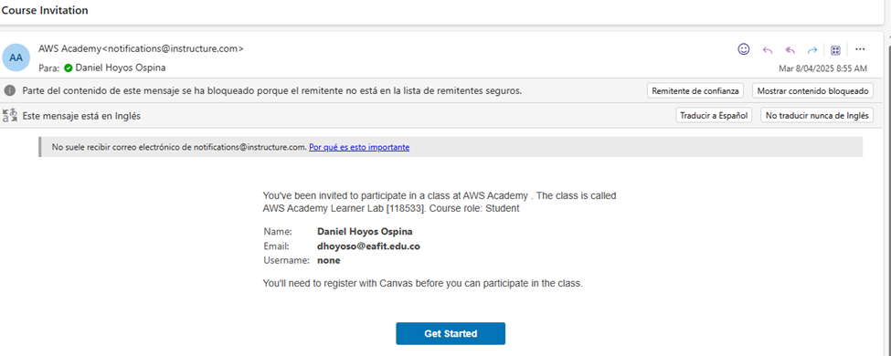
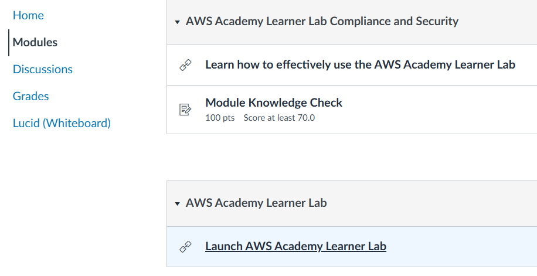
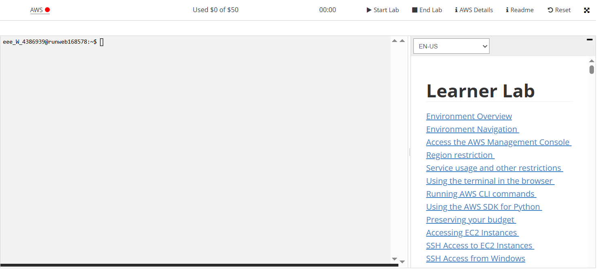
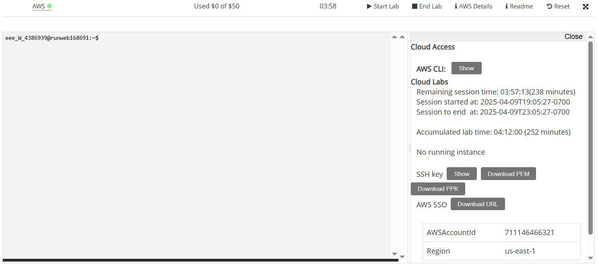

# Taller Grupal Entregable 3: Despliegue Continuo (CD) con AWS ECS e Infraestructura como Código

Este taller es una continuación del Taller 2, donde construimos un pipeline de Integración Continua (CI) que genera una imagen Docker de nuestra aplicación. Ahora, nos enfocaremos en la **Entrega Continua (Continuous Delivery)** y el **Despliegue Continuo (Continuous Deployment)**, automatizando el despliegue de esa imagen Docker a **AWS Elastic Container Service (ECS)**, primero a un entorno de **Staging** y luego a **Producción**, utilizando **Infraestructura como Código (IaC)** con **AWS CloudFormation**.

Te invito a que investigues un poco sobre estos servicios y conceptos antes de comenzar, ya que son fundamentales para el desarrollo moderno de software y la entrega continua.

Aquí algunos links útiles para ello:
* [AWS ECS](https://aws.amazon.com/ecs/)
* [AWS Cloudformation](https://aws.amazon.com/cloudformation/)

## Conceptos Previos
* **AWS CLI**: Interfaz de línea de comandos para interactuar con AWS. Permite gestionar recursos y servicios de AWS desde la terminal.
* **AWS Cloudformation**: Servicio que permite crear y gestionar recursos de AWS mediante plantillas de infraestructura como código. Permite definir la infraestructura de manera declarativa y reproducible.
* **Docker**: Plataforma para desarrollar, enviar y ejecutar aplicaciones en contenedores. Permite empaquetar aplicaciones y sus dependencias en un solo contenedor, asegurando que funcionen de manera consistente en diferentes entornos.

## Pre requisitos
* Haber finalizado el taller 2 y tener los artefactos desarrollados en ese taller (app, Dockerfile, tests, pipeline de CI, etc.).
* Instalar AWS CLI. Puedes seguir la guía oficial [aquí](https://docs.aws.amazon.com/cli/latest/userguide/getting-started-install.html).
* Instalar Docker. Puedes seguir la guía oficial [aquí](https://docs.docker.com/get-docker/). Puedes omitir este paso si ya tienes Docker instalado y funcionando en tu máquina. Asegúrate de que Docker esté corriendo y que puedas ejecutar comandos de Docker desde la terminal. Puedes verificarlo ejecutando `docker --version`.
* Tener acceso a una cuenta de AWS:
  * Para este curso, les debió haber llegado en la(s) ultima(s) semanas un correo electrónico con asunto "Course Invitation" de AWS Academy. 
  
  * Lo abren, hacen click en el botón "Get Started" y siguen las instrucciones para crear su cuenta de Canvas y AWS Academy.
  * Una vez tienen su cuenta creada, pueden ingresar usando el siguiente [link](https://www.awsacademy.com/vforcesite/LMS_Login), en el botón "Student Login" con su correo y contraseña.
  * Una vez ingresan, van a estar en el dashboard y deben hacer click en el curso llamado "AWS Academy Learning Lab".
  * Una vez dentro del curso, van a la sección "Modules" o "Modulos" y buscan el apartado "AWS Academy Learning Lab" y dan click en "Launch AWS Academy Learning Lab".
  
  * Bajan hasta el final y aceptan los términos y condiciones "I agree".
  * Luego, les debe aparecer una consola como esta, allí deben dar click en "Start Lab" (aparecerá un icono de carga que puede tomar varios minutos). Esto les va a habilitar una cuenta de AWS con un presupuesto de $50 USD para que puedan hacer los ejercicios de este taller. Cada vez que dan "Start Lab" se inicia una sesión que dura 4 horas, al finalizarse la sesión se suspende la cuenta y su uso.
  
  * Una vez el botón al lado de AWS (que estaba en rojo y durante el encendido estaba en amarillo) se pone en verde, pueden dar click en "AWS Details" para ver los detalles de su cuenta de AWS. Allí pueden dar click en `AWS CLI: Show` para ver sus credenciales de acceso programático (Access Key ID, Secret Access Key y Session Token) que necesitarán para configurar el AWS CLI. **¡Nunca compartas tus credenciales ni las subas a GitHub directamente!**. En la parte de abajo también pueden ver el ID y región de su cuenta de AWS, que es importante para la configuración del pipeline de GitHub Actions.
  
  * Si dan click al botón de "AWS" en la parte superior, se abrirá una consola de AWS en una nueva pestaña. Allí pueden ver todos los servicios de AWS disponibles para su cuenta. **Recuerden que esta cuenta tiene un presupuesto limitado de $50 USD, así que deben tener cuidado con los recursos que crean y eliminarlos cuando terminen de usarlos.** En el taller no será necesario crear recursos manualmente, ya que todo se hará a través del Cloudformation y el pipeline de GitHub Actions. Sin embargo, si necesitan crear recursos manualmente o validar la creación de los recursos y la salud de los mismos, pueden hacerlo desde esta consola.
  * **¡MUY IMPORTANTE!**: Recuerden que esta cuenta de AWS es temporal y solo está disponible durante la duración del curso. No deben usarla para proyectos personales o producción. Al finalizar el curso, su cuenta será desactivada y perderán acceso a todos los recursos creados.

  *  **Características clave de la sesión y la cuenta de AWS:**

        1.  **Persistente:** Aunque tu sesión termine cuando el contador llegue a 0:00, todos los datos y recursos que hayas creado se guardarán. Al iniciar una nueva sesión (incluso otro día), encontrarás tu trabajo anterior.
        2.  **Estado de los Recursos al Terminar/Iniciar Sesión:**
            * **Instancias EC2:** Se detendrán al finalizar la sesión y se reiniciarán automáticamente la próxima vez que inicies una.
            * **Instancias de Notebook SageMaker:** Se detendrán, pero *no* se reiniciarán automáticamente en la siguiente sesión.
            * **Aplicaciones SageMaker Canvas:** Permanecerán activas a menos que las elimines manualmente.
        3.  **¡MUY IMPORTANTE: Presupuesto!**
            * Debes monitorear constantemente tu presupuesto restante en la interfaz del laboratorio.
            * Esta información del presupuesto se actualiza cada 8 a 12 horas, por lo que puede no reflejar tu gasto más reciente inmediatamente.
            * **Si excedes tu presupuesto, tu cuenta será desactivada y perderás TODO tu progreso y recursos.** Es fundamental que administres tus gastos para evitarlo.
            * Monitoriza tu gasto en la interfaz de Learner Lab. Usa los recursos mínimos sugeridos y considera **eliminar los stacks de cloudformation (infraestructura)** desde la consola después de validar el taller para ahorrar presupuesto.
        4. **Región:**
            * **SOLO** puedes usar las regiones `us-east-1` (N. Virginia) o `us-west-2` (Oregón) para todos tus recursos (CLI, secretos). Cualquier intento de usar otra región fallará.
            * **La región que utilizaremos en este taller es `us-east-1` (N. Virginia)**. Asegúrate de que tu configuración local (AWS CLI) y el pipeline de GitHub Actions estén configurados para esta región (ver sección 5.1).
        5. **Rol IAM `LabRole`:** No puedes crear roles IAM libremente. Debes usar el rol pre-creado `LabRole` donde sea necesario (especialmente en la configuración de tareas ECS). El template de CloudFormation ya lo tiene en cuenta. Este rol tiene permisos limitados y no puedes modificarlo.


## 1. Conceptos de Entrega Continua y Despliegue Continuo (CD)

* **Entrega Continua (Continuous Delivery):** Práctica donde los cambios de código (empaquetados como artefactos, en nuestro caso, una imagen Docker) se construyen, prueban y preparan *automáticamente* para producción. La imagen se despliega automáticamente a un entorno de **Staging** (o pre-producción). La *liberación* a **Producción** requiere una **aprobación manual** o un trigger deliberado. El objetivo es tener *siempre* una versión validada lista para ir a producción rápidamente.
* **Despliegue Continuo (Continuous Deployment):** Va un paso más allá. *Cada cambio* (cada nueva imagen Docker) que pasa *todas* las etapas automatizadas (incluyendo pruebas en Staging) se despliega **automáticamente a Producción** sin intervención humana. Requiere una confianza extrema en la automatización y las pruebas. **Este es el enfoque que implementaremos principalmente en este taller.**

**Flujo de trabajo General:**

1.  **CI (Integración Continua):** Código -> Build -> Pruebas (Unit) -> Análisis -> **Imagen Docker (Artefacto)** -> Push a Docker Hub. (Cubierto en Taller 2).
2.  **CD (Este Taller - Deployment con Staging y CloudFormation):** Imagen Docker -> **Deploy Infra Staging (CloudFormation - Auto)** -> **Pruebas Aceptación en Staging (Auto)** -> **Deploy Infra Producción (CloudFormation - Auto)** -> **Pruebas Humo en Producción (Auto)** -> Monitoreo (Inherente en ECS).

## 2. Diferencias entre Continuous Deployment y Continuous Delivery

| Característica         | Continuous Delivery                      | Continuous Deployment                         |
| :--------------------- | :--------------------------------------- | :-------------------------------------------- |
| **Despliegue a Prod.** | Manual (requiere aprobación)             | Automático (sin intervención manual)          |
| **Frecuencia Despl.** | Controlada (puede ser frecuente)         | Muy frecuente (cada imagen validada)          |
| **Confianza Automat.** | Alta                                     | **Extrema** (requiere pruebas/monitoreo robustos) |
| **Velocidad (Lead Time)**| Más lento                                | Más rápido                                    |
| **Intervención Humana**| Sí (para liberar a Prod)                 | No (idealmente)                               |
| **Feedback Producción**| Retrasado por aprobación                   | Muy rápido (directamente de producción)       |

La elección depende del contexto. En este taller implementaremos un flujo de Despliegue Continuo utilizando AWS ECS y CloudFormation, introduciendo un entorno de Staging y un despliegue automático a Producción una vez validadas las pruebas en Staging.

## 3. Introducción a AWS y ECS

Para este taller, utilizaremos **Amazon Web Services (AWS)**, el proveedor líder de servicios en la nube. Específicamente, usaremos **Elastic Container Service (ECS)** para orquestar y ejecutar nuestros contenedores Docker. ECS es un servicio altamente escalable y de alto rendimiento que facilita la ejecución de aplicaciones en contenedores en AWS similar a Docker Swarm o Kubernetes.

**¿Por qué AWS ECS para este taller?**

* Es un servicio de orquestación de contenedores potente y ampliamente utilizado en la industria.
* Se integra nativamente con otros servicios de AWS (VPC, Load Balancing, IAM, CloudWatch).
* Ofrece opciones flexibles de cómputo (EC2 y Fargate). Usaremos **Fargate** para simplificar la gestión.
* Los créditos iniciales pueden cubrir los costos de este ejercicio si se usan recursos mínimos (instancias `nano` o configuraciones Fargate pequeñas).
* Nos permite implementar **Infraestructura como Código** usando CloudFormation.

## 4. CI/CD en Arquitecturas Modernas

### 4.1 Contenedores (Docker)

Los contenedores Docker son la base de nuestro despliegue. Como vimos en el Taller 2, empaquetan nuestra aplicación Flask y sus dependencias. Son consistentes, portátiles y permiten despliegues rápidos. La imagen generada en CI se subirá a Docker Hub y AWS ECS la descargará para ejecutarla.

**Ventajas clave para CD:**

* **Inmutabilidad:** Una vez construida, la imagen no cambia. Desplegamos la *misma* imagen en Staging y Producción, garantizando consistencia.
* **Portabilidad:** La imagen creada localmente o en CI se puede ejecutar en AWS ECS sin modificaciones.
* **Despliegue rápido:** Iniciar un contenedor es mucho más rápido que aprovisionar una VM.

**Docker en nuestro CI/CD con AWS:**

1.  **Dockerfile:** Definido en Taller 2.
2.  **Construcción y Push:** Realizado en el pipeline de CI (Taller 2), la imagen se almacena en Docker Hub.
3.  **Registro:** Usamos Docker Hub como nuestro registro de imágenes. AWS ECS descargará la imagen desde allí.
4.  **Despliegue en ECS:** El pipeline de CD le dirá a AWS ECS que descargue una versión específica de la imagen (identificada por su tag, ej: el SHA del commit) y la ejecute como un servicio.

### 4.2 Kubernetes (Alternativa a ECS)

Kubernetes (K8s) es otro potente orquestador de contenedores. Aunque no lo usaremos en este taller, es importante conocerlo como una alternativa a ECS, especialmente para escenarios multicloud o de mayor complejidad. AWS ofrece un servicio gestionado de Kubernetes llamado EKS (Elastic Kubernetes Service). Los conceptos de Pods, Services, Deployments son similares a los Task Definitions, Services y Load Balancers en ECS.

### 4.3 Serverless (Alternativa a Contenedores para ciertos casos)

Serverless, como AWS Lambda, es excelente para código basado en eventos o APIs simples. Para una aplicación web como la nuestra, que necesita estar ejecutándose constantemente para recibir peticiones HTTP, ECS (o K8s) suele ser más adecuado que una arquitectura puramente basada en funciones Lambda + API Gateway, aunque existen patrones híbridos.

## 5. AWS CLI (Command Line Interface)

La AWS CLI es una herramienta unificada para administrar tus servicios de AWS desde la línea de comandos. Es esencial para automatizar tareas e interactuar con AWS desde scripts o pipelines de CI/CD.

```bash
# Verifica la instalación de AWS CLI que realizaste en la sección de prerequisitos
aws --version
```

### 5.1 Configuración Local

Una vez instalado, necesitas configurar la CLI con tus credenciales de AWS. Desde AWS Academy copia todo el archivo de credenciales (Access Key ID, Secret Access Key y Session Token) tal y como se muestra en la consola de AWS Academy incluyendo el perfil `[default]`. 

Luego, busca el archivo de credenciales en tu máquina local (usualmente `~/.aws/credentials` en Linux/Mac o `C:\Users\<tu_usuario>\.aws\credentials` en Windows) y pega el contenido del archivo de credenciales que copiaste de AWS Academy.

Luego corre el comando `aws configure` en la terminal para configurar la CLI. Este comando te pedirá que ingreses tus credenciales de AWS (simplemente presiona Enter si ya las copiaste en el archivo de credenciales). Luego, te pedirá que ingreses la región y el formato de salida. Puedes dejar el formato de salida en blanco o elegir `json` y la región `us-east-1` (N. Virginia) como se mencionó anteriormente.

Finalmente, puedes probar si la configuración funciona correctamente ejecutando un comando simple como:
```bash
aws sts get-caller-identity
```

Te debe retornar información sobre tu identidad de AWS, algo similar a:
```json
{
    "UserId": "AIDAEXAMPLE",
    "Account": "123456789012",
    "Arn": "arn:aws:iam::123456789012:user/YourUserName"
}
```
Esto indica que la CLI está configurada correctamente y puede interactuar con tu cuenta de AWS.

### 5.2 Uso en el Pipeline

En nuestro pipeline de GitHub Actions, no usaremos `aws configure` interactivamente. En su lugar, utilizaremos una acción específica (`aws-actions/configure-aws-credentials`) que configura las credenciales de forma segura usando secretos almacenados en GitHub. Los comandos de la AWS CLI (como `aws cloudformation deploy` y `aws ecs update-service`) se ejecutarán directamente en los pasos del workflow después de configurar las credenciales.

**Ten en cuenta que las credenciales que setearemos en el pipeline de GitHub Actions son temporales** y solo tienen acceso a los recursos que les otorguemos. Esto es una buena práctica de seguridad, ya que minimiza el riesgo de exposición de credenciales permanentes.

**Al ser temporales quiere decir que tienen un tiempo de vida limitado usualmente de 1 a 4 horas. Esto significa que si pasa ese tiempo y queremos re ejecutar el pipeline, las credenciales ya no serán válidas y tendremos que volver a configurar las variables de entorno en los secretos de GitHub Actions para que el pipeline pueda acceder a los recursos de AWS nuevamente.**

## 6. Infraestructura como Código (IaC) con AWS CloudFormation

**Infraestructura como Código (IaC)** es la práctica de gestionar infraestructura mediante código. AWS CloudFormation es el servicio de IaC nativo de AWS que te permite modelar y aprovisionar recursos de AWS de forma segura y repetible usando plantillas declarativas.

**Ventajas de CloudFormation:**

* **Declarativo:** Defines el estado deseado, CloudFormation se encarga de alcanzarlo.
* **Automatización y Consistencia:** Despliegues rápidos, repetibles y consistentes entre entornos.
* **Versionado:** Las plantillas se pueden versionar en Git.
* **Gestión de Dependencias:** CloudFormation entiende las dependencias entre recursos.
* **Gestión de Estado:** Mantiene el estado del stack y permite actualizaciones y eliminaciones controladas.

**Plantillas CloudFormation:**

* Son archivos de texto en formato **YAML** o JSON. Usaremos YAML por ser más legible.
* **Estructura Principal:**
    * `AWSTemplateFormatVersion`: Versión de la plantilla (opcional pero recomendado).
    * `Description`: Descripción de la plantilla.
    * `Parameters`: Valores de entrada para personalizar el stack (ej: nombre del entorno, ARN del rol, URI de la imagen).
    * `Resources`: La definición de los recursos AWS a crear (VPC, Subnets, ECS Cluster, Service, ALB, etc.). **Esta es la sección principal.**
    * `Outputs`: Valores que el stack expone después de crearse (ej: URL del ALB).

**Consideraciones para Learner Lab:**

* **Permisos:** CloudFormation ejecutará las acciones usando las credenciales con las que se invoca (tu rol de Learner Lab). Como no tienes el permiso `iam:CreateRole`, **no podemos definir recursos `AWS::IAM::Role`** en la plantilla. Debemos referenciar el `LabRole` existente.
* **VPC por Defecto:** Para simplificar y evitar posibles problemas de permisos al crear VPCs/Subnets/Gateways, usaremos la **VPC por defecto** y sus **subredes públicas**. Deberás identificar los IDs de estas subredes en tu cuenta/región.

## 7. Implementación del Pipeline CD con Staging y Producción en AWS ECS usando CloudFormation

1.  **Asegúrate de que el código de la aplicación y las pruebas estén listos:**

    * **`app/app.py`**:
        * Debe usar un puerto configurable: `app_port = int(os.environ.get("PORT", 5000))` (ECS suele inyectar la variable `PORT`). Gunicorn en el Dockerfile ya expone el puerto 8000.
        * Debe tener `debug=False`.
        * Debe incluir el endpoint `/health`:
            ```python
            @app.route("/health")
            def health():
                return "OK", 200
            ```
            Este endpoint es importante para el **health check** del ALB. El ALB enviará peticiones a este endpoint para verificar que la aplicación esté viva y respondiendo. Si no responde o devuelve un error, el ALB considerará que la tarea está fallando y tomará las acciones necesarias (como reiniciar la tarea (contenedor) o redirigir el tráfico a otra instancia).
    * **Pruebas de Aceptación (`tests/test_acceptance_app.py`):**
        * Asegúrate de que este archivo exista (creado en Taller 2).
        * Verifica que la `BASE_URL` se lea desde una variable de entorno `APP_BASE_URL` que luego estableceremos en el pipeline para apuntar al ALB de Staging.
        * Un ALB es un balanceador de carga que distribuye el tráfico entre múltiples instancias de tu aplicación. En este caso dichas instancias son los contenedores de ECS que ejecutan tu aplicación Flask. El ALB se encargará de enrutar las peticiones HTTP a los contenedores disponibles, asegurando alta disponibilidad y escalabilidad.
            ```python
            # Ejemplo en tests/test_acceptance_app.py
            import os
            # ... otros imports ...
            BASE_URL = os.environ.get("APP_BASE_URL", "http://localhost:5000") # La variable APP_BASE_URL se inyectará en el pipeline con la URL del ALB de Staging.
            # ...
            def test_calculadora(browser, num1, num2, operacion, resultado_esperado):
                 browser.get(BASE_URL + "/") # Asegúrate que usa la variable
                 # ... resto de la prueba ...
            ```
    * **Pruebas de Humo (`tests/test_smoke_app.py`):**
        * **Crea este archivo nuevo en la carpeta `tests/`** con el siguiente contenido:
            ```python
            # tests/test_smoke_app.py
            import os
            from selenium.webdriver.common.by import By
            from selenium import webdriver
            import pytest

            # Fixture para configurar el navegador (similar a las pruebas de aceptación)
            @pytest.fixture
            def browser():
                options = webdriver.ChromeOptions()
                options.add_argument("--headless")  # Ejecuta sin interfaz gráfica
                options.add_argument("--no-sandbox") # Necesario para algunos entornos
                options.add_argument("--disable-dev-shm-usage") # Necesario para algunos entornos
                driver = webdriver.Chrome(options=options)
                yield driver
                driver.quit()

            def test_smoke_test(browser):
                """SMOKE TEST: Verifica carga básica y título."""
                # Lee la URL de producción desde una variable de entorno
                app_url = os.environ.get("APP_BASE_URL", "http://localhost:5000") # Usar la variable de entorno APP_BASE_URL que inyectaremos en el pipeline con la URL del ALB de Producción
                print(f"Smoke test ejecutándose contra: {app_url}") # Imprime para depuración
                try:
                    browser.get(app_url + "/")
                    print(f"Título de la página: {browser.title}")
                    assert "Calculadora" in browser.title # Verifica que el título contenga "Calculadora"
                    h1_element = browser.find_element(By.TAG_NAME, "h1")
                    print(f"Texto H1: {h1_element.text}")
                    assert h1_element.text == "Calculadora" # Verifica el texto del H1
                    print("Smoke test pasado exitosamente.")
                except Exception as e:
                    print(f"Smoke test falló: {e}")
                    # Opcional: tomar captura de pantalla si falla
                    # browser.save_screenshot('smoke_test_failure.png')
                    raise # Vuelve a lanzar la excepción para que pytest marque el test como fallido
            ```
        * Esta prueba verifica la carga básica de la página principal y el título en el entorno de **Producción**. Utiliza la variable de entorno `APP_BASE_URL` que configuraremos en el pipeline para apuntar al ALB de Producción.

        * **`.github/workflows/ci.yml`**:
            * Modifica el archivo `ci.yml` para excluir de las pruebas unitarias el archivo `tests/test_smoke_app.py` (ya que no queremos ejecutar pruebas de humo en Staging). Puedes hacerlo agregando un filtro en el paso de pruebas unitarias:
            ```yaml
            - name: Run Unit Tests with pytest and Coverage
                run: |
                pytest --ignore=tests/test_acceptance_app.py  --ignore=tests/test_smoke_app.py
            ```

3.  **Identifica Recursos de la VPC por Defecto y ARN de LabRole:**
    * **ARN de LabRole:**
        * Ve a la consola de AWS en la barra de búsqueda escribe `IAM` y selecciona el servicio IAM, luego haz clic en `Roles` en el menú de la izquierda.
        * Busca el rol llamado `LabRole`.
        * Haz clic en él y copia su **ARN** (ej: `arn:aws:iam::123456789012:role/LabRole`). **Lo necesitarás.**
    * **ID de la VPC por Defecto:**
        * Ve a la consola de AWS en la barra de búsqueda escribe `VPC` y selecciona el servicio VPC. Luego haz clic en `Your VPCs` en el menú de la izquierda.
        * Copia el **ID** de la VPC por defecto (ej: `vpc-zzzzzzzzzzzzzzzzz`). **Lo necesitarás.**
    * **IDs de Subredes Públicas por Defecto:**
        * Ve a la consola de AWS en la barra de búsqueda escribe `VPC` y selecciona el servicio VPC. Luego haz clic en `Subnets` en el menú de la izquierda.
        * Identifica al menos **dos** subredes en diferentes Zonas de Disponibilidad dentro de esa VPC por defecto. Verifica que sus tablas de rutas asociadas tengan una ruta `0.0.0.0/0` apuntando a un Internet Gateway (`igw-...`). Estas son tus subredes públicas.
        * Copia los **IDs** de estas subredes (ej: `subnet-xxxxxxxxxxxxxxxxx`, `subnet-yyyyyyyyyyyyyyyyy`). **Los necesitarás.**

4.  **Crea la Plantilla CloudFormation (`template.yaml`):**
    * Crea un archivo llamado `template.yaml` en la raíz de tu repositorio.
    * Pega el siguiente contenido YAML en él. Lee los comentarios cuidadosamente.

```yaml
AWSTemplateFormatVersion: '2010-09-09'
Description: >
  CloudFormation template para desplegar la aplicacion Calculadora en ECS Fargate
  con ALB. Usa la VPC por defecto y el LabRole existente.

Parameters:
  EnvironmentName:
    Type: String
    Description: "Nombre del entorno (ej: staging, production). Usado para nombrar recursos."
    AllowedValues: [staging, production]
  DockerImageUri:
    Type: String
    Description: "URI completo de la imagen Docker a desplegar (ej: usuario/repo:tag)."
  LabRoleArn:
    Type: String
    Description: ARN completo del rol IAM 'LabRole' existente en la cuenta.
  VpcId:
    Type: AWS::EC2::VPC::Id
    Description: ID de la VPC por defecto donde desplegar.
  SubnetIds:
    Type: List<AWS::EC2::Subnet::Id>
    Description: Lista de al menos DOS IDs de subredes PuBLICAS de la VPC por defecto en diferentes AZs.

Resources:
  # --- Grupo de Logs para ECS (NUEVO) ---
  ECSLogGroup:
    Type: AWS::Logs::LogGroup
    Properties:
      LogGroupName: !Sub '/ecs/calculadora-${EnvironmentName}-task'
      RetentionInDays: 7 # Retener logs por 7 días (ajusta si es necesario)
      Tags:
        - Key: Environment
          Value: !Ref EnvironmentName

  # --- Cluster ECS ---
  ECSCluster:
    Type: AWS::ECS::Cluster
    Properties:
      ClusterName: !Sub 'calculadora-${EnvironmentName}-cluster'
      Tags:
        - Key: Environment
          Value: !Ref EnvironmentName

  # --- Seguridad ---
  # Security Group para el Load Balancer (permite HTTP desde internet)
  ALBSecurityGroup:
    Type: AWS::EC2::SecurityGroup
    Properties:
      GroupName: !Sub 'alb-sg-${EnvironmentName}'
      GroupDescription: Permite trafico HTTP al ALB
      VpcId: !Ref VpcId
      SecurityGroupIngress:
        - IpProtocol: tcp
          FromPort: 80
          ToPort: 80
          CidrIp: 0.0.0.0/0
      Tags:
        - Key: Environment
          Value: !Ref EnvironmentName

  # Security Group para el Servicio ECS (permite trafico desde el ALB en el puerto 8000)
  ECSServiceSecurityGroup:
    Type: AWS::EC2::SecurityGroup
    Properties:
      GroupName: !Sub 'ecs-service-sg-${EnvironmentName}'
      GroupDescription: Permite trafico desde el ALB al servicio ECS
      VpcId: !Ref VpcId
      SecurityGroupIngress:
        - IpProtocol: tcp
          FromPort: 8000 # Puerto del contenedor
          ToPort: 8000
          SourceSecurityGroupId: !Ref ALBSecurityGroup # Solo permite desde el ALB SG
      Tags:
        - Key: Environment
          Value: !Ref EnvironmentName

  # --- Load Balancer ---
  ApplicationLoadBalancer:
    Type: AWS::ElasticLoadBalancingV2::LoadBalancer
    Properties:
      Name: !Sub 'calculadora-${EnvironmentName}-alb'
      Subnets: !Ref SubnetIds # Debe estar en subredes publicas
      SecurityGroups:
        - !Ref ALBSecurityGroup
      Scheme: internet-facing
      Type: application
      Tags:
        - Key: Environment
          Value: !Ref EnvironmentName

  # Listener HTTP en el puerto 80
  ALBListener:
    Type: AWS::ElasticLoadBalancingV2::Listener
    Properties:
      LoadBalancerArn: !Ref ApplicationLoadBalancer
      Port: 80
      Protocol: HTTP
      DefaultActions:
        - Type: forward
          TargetGroupArn: !Ref ECSTargetGroup

# Target Group para las tareas ECS
  ECSTargetGroup:
    Type: AWS::ElasticLoadBalancingV2::TargetGroup
    Properties:
      Name: !Sub 'tg-ecs-${EnvironmentName}'
      VpcId: !Ref VpcId
      Port: 8000 # Puerto del contenedor
      Protocol: HTTP
      TargetType: ip # Necesario para Fargate
      # --- Propiedades de Health Check (CORREGIDO) ---
      HealthCheckEnabled: true
      HealthCheckPath: /health # Endpoint de health check de la app
      HealthCheckPort: '8000' # Puerto del contenedor
      HealthCheckProtocol: HTTP
      HealthyThresholdCount: 2
      UnhealthyThresholdCount: 2
      HealthCheckIntervalSeconds: 15 # Nombre corregido
      HealthCheckTimeoutSeconds: 5  # Nombre corregido
      # --- Fin Propiedades de Health Check ---
      Tags:
        - Key: Environment
          Value: !Ref EnvironmentName

  # --- Definicion de Tarea ECS ---
  ECSTaskDefinition:
    Type: AWS::ECS::TaskDefinition
    DependsOn: ECSLogGroup # Asegura que el Log Group exista primero
    Properties:
      Family: !Sub 'calculadora-${EnvironmentName}-task'
      RequiresCompatibilities:
        - FARGATE
      NetworkMode: awsvpc
      Cpu: '256' # 0.25 vCPU (minimo Fargate)
      Memory: '512' # 0.5 GB (minimo Fargate)
      TaskRoleArn: !Ref LabRoleArn # Rol para permisos DENTRO del contenedor (si necesita llamar a otros servicios AWS)
      ExecutionRoleArn: !Ref LabRoleArn # Rol para que ECS/Fargate pueda descargar imagen, enviar logs, etc.
      ContainerDefinitions:
        - Name: !Sub 'calculadora-${EnvironmentName}-container'
          Image: !Ref DockerImageUri # Imagen de Docker Hub
          PortMappings:
            - ContainerPort: 8000
              Protocol: tcp
          LogConfiguration:
            LogDriver: awslogs
            Options:
              # Usar !Ref para hacer referencia al Log Group creado
              awslogs-group: !Ref ECSLogGroup
              awslogs-region: !Ref AWS::Region
              awslogs-stream-prefix: ecs
      Tags:
        - Key: Environment
          Value: !Ref EnvironmentName

  # --- Servicio ECS ---
  ECSService:
    Type: AWS::ECS::Service
    Properties:
      ServiceName: !Sub 'calculadora-${EnvironmentName}-service'
      Cluster: !Ref ECSCluster
      TaskDefinition: !Ref ECSTaskDefinition
      DesiredCount: 1 # Numero inicial de tareas
      LaunchType: FARGATE
      NetworkConfiguration:
        AwsvpcConfiguration:
          AssignPublicIp: ENABLED # Necesario en subredes publicas sin NAT Gateway
          Subnets: !Ref SubnetIds # Las mismas subredes publicas del ALB
          SecurityGroups:
            - !Ref ECSServiceSecurityGroup
      LoadBalancers:
        - ContainerName: !Sub 'calculadora-${EnvironmentName}-container'
          ContainerPort: 8000
          TargetGroupArn: !Ref ECSTargetGroup
      # DesiredCount y TaskDefinition se actualizan en despliegues posteriores
      DeploymentConfiguration:
        MinimumHealthyPercent: 50 # Permite que baje al 50% durante el deploy
        MaximumPercent: 200 # Permite que suba al 200% temporalmente
      Tags:
        - Key: Environment
          Value: !Ref EnvironmentName
    DependsOn: # Asegura que el listener exista antes de crear el servicio
      - ALBListener

Outputs:
  ALBDnsName:
    Description: DNS Name of the Application Load Balancer
    Value: !GetAtt ApplicationLoadBalancer.DNSName
    Export:
      Name: !Sub '${AWS::StackName}-ALBDnsName'
  ECSClusterName:
    Description: Name of the ECS Cluster
    Value: !Ref ECSCluster
    Export:
      Name: !Sub '${AWS::StackName}-ECSClusterName'
  ECSServiceName:
    Description: Name of the ECS Service
    Value: !GetAtt ECSService.Name # Obtener el nombre completo del servicio
    Export:
      Name: !Sub '${AWS::StackName}-ECSServiceName'
```

5. **Versiona los cambios en tu repositorio:**

    ```bash
    git add *
    git commit -m "Ajustes código, pruebas de humo y CloudFormation template"
    git push origin main
    ```

6. **Asegurate de que el pipeline de CI actual corra bien y llegue hasta desplegar la nueva imágen Docker en Docker Hub.**
    * Verifica que la imagen se haya subido correctamente a Docker Hub. Ve a tu repositorio de Docker Hub y verifica que la imagen `cicd-pipeline-python` esté disponible con el tag `latest` (o el SHA del commit) y que el **last pushed sea reciente**.

    * Esto es importante porque esta nueva versión de la imágen Docker será la que usaremos en el despliegue de CloudFormation para Staging y Producción. Si no se subió correctamente, el despliegue fallará o nunca finalizará por que no encontrará el health check del ALB lo que hará que el servicio ECS no esté disponible.

    * Si el pipeline no corre bien, corrige los defectos, pruebas unitarias y demás hasta que llegue a la etapa de subir la imagen Docker a Docker Hub. **No continúes hasta que el pipeline corra bien y suba la imagen Docker.**

7.  **Despliega la Infraestructura Inicialmente (Manual con CloudFormation):**
    * Asegúrate de tener la AWS CLI configurada.
    * Navega a la raíz de tu repositorio (donde está `template.yaml`).
    * Ejecuta el comando `aws cloudformation deploy` **DOS VECES**, una para Staging y otra para Producción. Reemplaza los placeholders `<...>` con tus valores reales y si estás en Windows cambia los backslashes de los saltos de línea por `^` (caracter de escape de Windows).

        ```bash
        # --- Despliegue Staging ---
        aws cloudformation deploy \
          --template-file template.yaml \
          --stack-name calculadora-staging-stack \
          --parameter-overrides \
            EnvironmentName=staging \
            DockerImageUri=<TU_USUARIO_DOCKERHUB>/cicd-pipeline-python:latest \
            LabRoleArn=<ARN_COMPLETO_DE_TU_LABROLE> \
            VpcId=<ID_DE_TU_VPC_POR_DEFECTO> \
            SubnetIds=<ID_SUBNET_PUBLICA_1>,<ID_SUBNET_PUBLICA_2> \
          --capabilities CAPABILITY_IAM CAPABILITY_NAMED_IAM \
          --region us-east-1

        # Espera a que termine... luego obtén las salidas si es necesario:
        aws cloudformation describe-stacks --stack-name calculadora-staging-stack --query "Stacks[0].Outputs" --region us-east-1

        # --- Despliegue Producción ---
        aws cloudformation deploy \
          --template-file template.yaml \
          --stack-name calculadora-prod-stack \
          --parameter-overrides \
            EnvironmentName=production \
            DockerImageUri=<TU_USUARIO_DOCKERHUB>/cicd-pipeline-python:latest \
            LabRoleArn=<ARN_COMPLETO_DE_TU_LABROLE> \
            VpcId=<ID_DE_TU_VPC_POR_DEFECTO> \
            SubnetIds=<ID_SUBNET_PUBLICA_1>,<ID_SUBNET_PUBLICA_2>
          --capabilities CAPABILITY_IAM CAPABILITY_NAMED_IAM \
          --region us-east-1

        # Espera a que termine... luego obtén las salidas si es necesario:
        aws cloudformation describe-stacks --stack-name calculadora-prod-stack --query "Stacks[0].Outputs" --region us-east-1
        ```
    * **`--capabilities CAPABILITY_IAM CAPABILITY_NAMED_IAM`**: Son necesarias porque estamos haciendo referencia a un rol IAM existente (`LabRoleArn`) y CloudFormation necesita confirmación explícita para trabajar con recursos IAM.
    * **Verifica en la Consola:** Ve a AWS CloudFormation y confirma que ambos stacks (`calculadora-staging-stack`, `calculadora-prod-stack`) se hayan creado correctamente (`CREATE_COMPLETE`).
    * **Obtén las Salidas:** Anota las URLs de los ALBs, los nombres de los Clusters y los nombres de los Servicios de las salidas de los stacks (ya sea desde la consola de CloudFormation o usando el comando `describe-stacks`).
    * **Valida el despliege correcto de la imágen Docker en Staging:** Abre la URL del ALB de Staging en tu navegador que te arrojó el comando `describe-stacks` en la variable `ALBDnsName` o desde la consola de CloudFormation en Outputs del stack `calculadora-staging-stack` (ej: `http://calculadora-staging-alb-xxxxxx.us-east-1.elb.amazonaws.com` o similar) y verifica que la página cargue correctamente (ej: `http://calculadora-staging-alb-xxxxxx.us-east-1.elb.amazonaws.com/` o similar). Deberías ver la página de la calculadora. Si no, revisa los logs de ECS y el ALB para identificar problemas.
    * **Valida el despliegue correcto de la imágen Docker en Producción:** repite el paso anterior pero con la URL del ALB de Producción (ej: `http://calculadora-prod-alb-xxxxxx.us-east-1.elb.amazonaws.com` o similar). Deberías ver la página de la calculadora. Si no, revisa los logs de ECS y el ALB para identificar problemas.
    * **Valida la correcta creación de los stacks:** Ve a la consola de CloudFormation (ve a la consola de AWS y busca `CloudFormation` en la barra de búsqueda) y selecciona `Stacks` en el menú de la izquierda. Allí deberías ver los stacks que creaste (`calculadora-staging-stack`, `calculadora-prod-stack`). Haz clic en cada uno de ellos y verifica que ambos stacks (`calculadora-staging-stack`, `calculadora-prod-stack`) se hayan creado correctamente (`CREATE_COMPLETE`). Esto puede tardar unos minutos. No continúes hasta que ambos stacks estén en estado `CREATE_COMPLETE` y hayas verificado que los ALBs están funcionando correctamente.

8.  **Crea los secretos en GitHub:**
    * Antes de hacer lo siguiente, reinicia la sesión de AWS Academy (stop y start) para que se generen nuevas credenciales temporales. Esto es importante porque los secretos de GitHub Actions usarán estas credenciales para interactuar con AWS y Docker Hub (**recuerda que son temporales y tienen un tiempo de vida limitado**).
    * Ve a tu repositorio en GitHub -> Settings -> Secrets and variables -> Actions -> New repository secret.
    * Crea los siguientes secretos (ajustados para CloudFormation):
        * `AWS_ACCESS_KEY_ID`: Tu AWS Access Key ID.
        * `AWS_SECRET_ACCESS_KEY`: Tu AWS Secret Access Key.
        * `AWS_REGION`: La región de AWS que usaste (`us-east-1` o `us-west-2`).
        * `DOCKERHUB_USERNAME`: Tu usuario de Docker Hub.
        * `DOCKERHUB_TOKEN`: Tu token de Docker Hub.
        * `SONAR_TOKEN`: Tu token de SonarCloud.
        * `SONAR_HOST_URL`: `https://sonarcloud.io`.
        * **`LAB_ROLE_ARN`**: El ARN completo de tu `LabRole`.
        * **`VPC_ID`**: El ID de tu VPC por defecto.
        * **`SUBNET_IDS`**: Los IDs de tus dos subredes públicas, separados por coma (ej: `subnet-xxx,subnet-yyy`).
        * **`AWS_ALB_URL_STAGING`**: La URL completa (http://...) del ALB de **Staging** (Output del stack CFN).
        * **`AWS_ALB_URL_PROD`**: La URL completa (http://...) del ALB de **Producción** (Output del stack CFN).
        * **`AWS_ECS_CLUSTER_STAGING`**: El nombre del cluster ECS de Staging (Output del stack CFN).
        * **`AWS_ECS_SERVICE_STAGING`**: El nombre del servicio ECS de Staging (Output del stack CFN).
        * **`AWS_ECS_CLUSTER_PROD`**: El nombre del cluster ECS de Producción (Output del stack CFN).
        * **`AWS_ECS_SERVICE_PROD`**: El nombre del servicio ECS de Producción (Output del stack CFN).

9.  **Renombra y modifica el archivo `.github/workflows/ci.yml` por `.github/workflows/ci-cd.yml`:**

    Renombra el archivo `.github/workflows/ci.yml` por `.github/workflows/ci-cd.yml` y modifica su contenido para que quede como el siguiente. **Asegúrate de que los nombres de los secretos y variables para las pruebas coincidan con los que creaste en el paso anterior y en el ajuste del código.**

    ```yaml
    name: CI/CD Pipeline AWS ECS con CloudFormation

    on:
      push:
        branches:
          - main
      pull_request:
        branches:
          - main
      workflow_dispatch:

    jobs:
      # -------------------------------------
      # Job de CI (Build, Test, Publish Docker Image)
      # -------------------------------------
      build-test-publish:
        runs-on: ubuntu-latest
        outputs:
          image_uri: ${{ steps.set_image_uri.outputs.image_uri }} # Exportar URI completo con tag SHA

        steps:
          - uses: actions/checkout@v4

          - name: Set up Python
            uses: actions/setup-python@v5
            with:
              python-version: '3.12'

          - name: Install dependencies
            run: |
              python -m pip install --upgrade pip
              pip install -r requirements.txt

          - name: Run Black (Formatter)
            run: black app --check

          - name: Run Pylint (Linter)
            run: pylint app --output-format=text --fail-under=9 > pylint-report.txt || true

          - name: Run Flake8 (Linter)
            run: flake8 app --output-file=flake8-report.txt || true

          - name: Run Unit Tests with pytest and Coverage
            run: |
              pytest --cov=app tests/ --ignore=tests/test_acceptance_app.py --ignore=tests/test_smoke_app.py --cov-report=xml

          - name: SonarCloud Scan
            uses: SonarSource/sonarcloud-scan-action@v2
            env:
              GITHUB_TOKEN: ${{ secrets.GITHUB_TOKEN }}
              SONAR_TOKEN: ${{ secrets.SONAR_TOKEN }}
              SONAR_HOST_URL: ${{ secrets.SONAR_HOST_URL }}

          # Pasos de Docker (solo en push a main)
          - name: Set up QEMU
            if: github.event_name == 'push' && github.ref == 'refs/heads/main'
            uses: docker/setup-qemu-action@v3

          - name: Set up Docker Buildx
            if: github.event_name == 'push' && github.ref == 'refs/heads/main'
            uses: docker/setup-buildx-action@v3

          - name: Login to Docker Hub
            if: github.event_name == 'push' && github.ref == 'refs/heads/main'
            uses: docker/login-action@v3
            with:
              username: ${{ secrets.DOCKERHUB_USERNAME }}
              password: ${{ secrets.DOCKERHUB_TOKEN }}

          - name: Build and push Docker image
            id: docker_build_push # Darle ID para referenciar output
            if: github.event_name == 'push' && github.ref == 'refs/heads/main'
            uses: docker/build-push-action@v5
            with:
              context: .
              file: ./Dockerfile
              push: true
              tags: | # Crear tag con SHA y latest
                ${{ secrets.DOCKERHUB_USERNAME }}/${{ github.event.repository.name }}:${{ github.sha }}
                ${{ secrets.DOCKERHUB_USERNAME }}/${{ github.event.repository.name }}:latest
              cache-from: type=gha
              cache-to: type=gha,mode=max

          # Exportar el URI con el tag SHA específico
          - name: Set Image URI Output
            id: set_image_uri
            if: github.event_name == 'push' && github.ref == 'refs/heads/main'
            run: echo "image_uri=${{ secrets.DOCKERHUB_USERNAME }}/${{ github.event.repository.name }}:${{ github.sha }}" >> $GITHUB_OUTPUT


      # -------------------------------------
      # Job de Despliegue CloudFormation Staging
      # -------------------------------------
      deploy-cfn-staging:
        needs: build-test-publish # Depende de CI y necesita la URI de la imagen
        runs-on: ubuntu-latest
        if: github.event_name == 'push' && github.ref == 'refs/heads/main'

        steps:
          - uses: actions/checkout@v4

          - name: Configure AWS Credentials
            uses: aws-actions/configure-aws-credentials@v4
            with:
              aws-access-key-id: ${{ secrets.AWS_ACCESS_KEY_ID }}
              aws-secret-access-key: ${{ secrets.AWS_SECRET_ACCESS_KEY }}
              aws-region: ${{ secrets.AWS_REGION }}

          - name: Deploy CloudFormation Staging Stack
            run: |
              aws cloudformation deploy \
                --template-file template.yaml \
                --stack-name calculadora-staging-stack \
                --parameter-overrides \
                  EnvironmentName=staging \
                  DockerImageUri=${{ needs.build-test-publish.outputs.image_uri }} \
                  LabRoleArn=${{ secrets.LAB_ROLE_ARN }} \
                  VpcId=${{ secrets.VPC_ID }} \
                  SubnetIds="${{ secrets.SUBNET_IDS }}" \
                --capabilities CAPABILITY_IAM CAPABILITY_NAMED_IAM \
                --no-fail-on-empty-changes # Evita error si no hay cambios en la infra

      # -------------------------------------
      # Job de Actualización Servicio Staging (ECS - Forzar despliegue)
      # -------------------------------------
      update-service-staging:
        # Depende de que CFN haya actualizado la Task Definition
        needs: [build-test-publish, deploy-cfn-staging]
        runs-on: ubuntu-latest
        if: github.event_name == 'push' && github.ref == 'refs/heads/main'

        steps:
          - name: Configure AWS Credentials
            uses: aws-actions/configure-aws-credentials@v4
            with:
              aws-access-key-id: ${{ secrets.AWS_ACCESS_KEY_ID }}
              aws-secret-access-key: ${{ secrets.AWS_SECRET_ACCESS_KEY }}
              aws-region: ${{ secrets.AWS_REGION }}

          - name: Force New Deployment ECS Service Staging
            run: |
              echo "Forcing new deployment for Staging service..."
              aws ecs update-service --cluster ${{ secrets.AWS_ECS_CLUSTER_STAGING }} \
                                     --service ${{ secrets.AWS_ECS_SERVICE_STAGING }} \
                                     --force-new-deployment \
                                     --region ${{ secrets.AWS_REGION }}
              echo "Waiting for Staging service deployment to stabilize..."
              aws ecs wait services-stable --cluster ${{ secrets.AWS_ECS_CLUSTER_STAGING }} --services ${{ secrets.AWS_ECS_SERVICE_STAGING }} --region ${{ secrets.AWS_REGION }}
              echo "Staging service deployment stable."

      # -------------------------------------
      # Job de Pruebas de Aceptación en Staging
      # -------------------------------------
      test-staging:
        needs: update-service-staging # Depende de que el servicio esté estable con la nueva versión
        runs-on: ubuntu-latest
        if: github.event_name == 'push' && github.ref == 'refs/heads/main'

        steps:
          - uses: actions/checkout@v4

          - name: Set up Python
            uses: actions/setup-python@v5
            with:
              python-version: '3.12'

          - name: Install test dependencies
            run: |
              python -m pip install --upgrade pip
              pip install -r requirements.txt # Incluye selenium, pytest

          - name: Run Acceptance Tests against Staging
            env:
              APP_URL_STAGING: ${{ secrets.AWS_ALB_URL_STAGING }} # URL Staging ALB
            run: |
              echo "Running acceptance tests against: $APP_URL_STAGING"
              sleep 30 # Esperar un poco por si el ALB tarda en registrar el nuevo target
              pytest tests/test_acceptance_app.py

      # -------------------------------------
      # Job de Despliegue CloudFormation Producción
      # -------------------------------------
      deploy-cfn-prod:
        needs: [build-test-publish, test-staging] # Depende de la imagen y de que Staging esté OK
        runs-on: ubuntu-latest
        if: github.event_name == 'push' && github.ref == 'refs/heads/main'

        steps:
          - uses: actions/checkout@v4

          - name: Configure AWS Credentials
            uses: aws-actions/configure-aws-credentials@v4
            with:
              aws-access-key-id: ${{ secrets.AWS_ACCESS_KEY_ID }}
              aws-secret-access-key: ${{ secrets.AWS_SECRET_ACCESS_KEY }}
              aws-region: ${{ secrets.AWS_REGION }}

          - name: Deploy CloudFormation Production Stack
            run: |
              aws cloudformation deploy \
                --template-file template.yaml \
                --stack-name calculadora-prod-stack \
                --parameter-overrides \
                  EnvironmentName=production \
                  DockerImageUri=${{ needs.build-test-publish.outputs.image_uri }} \
                  LabRoleArn=${{ secrets.LAB_ROLE_ARN }} \
                  VpcId=${{ secrets.VPC_ID }} \
                  SubnetIds="${{ secrets.SUBNET_IDS }}" \
                --capabilities CAPABILITY_IAM CAPABILITY_NAMED_IAM \
                --no-fail-on-empty-changes

      # -------------------------------------
      # Job de Actualización Servicio Producción (ECS - Forzar despliegue)
      # -------------------------------------
      update-service-prod:
        needs: [build-test-publish, deploy-cfn-prod] # Depende de que CFN haya actualizado la Task Def de Prod
        runs-on: ubuntu-latest
        if: github.event_name == 'push' && github.ref == 'refs/heads/main'

        steps:
          - name: Configure AWS Credentials
            uses: aws-actions/configure-aws-credentials@v4
            with:
              aws-access-key-id: ${{ secrets.AWS_ACCESS_KEY_ID }}
              aws-secret-access-key: ${{ secrets.AWS_SECRET_ACCESS_KEY }}
              aws-region: ${{ secrets.AWS_REGION }}

          - name: Force New Deployment ECS Service Production
            run: |
              echo "Forcing new deployment for Production service..."
              aws ecs update-service --cluster ${{ secrets.AWS_ECS_CLUSTER_PROD }} \
                                     --service ${{ secrets.AWS_ECS_SERVICE_PROD }} \
                                     --force-new-deployment \
                                     --region ${{ secrets.AWS_REGION }}
              echo "Waiting for Production service deployment to stabilize..."
              aws ecs wait services-stable --cluster ${{ secrets.AWS_ECS_CLUSTER_PROD }} --services ${{ secrets.AWS_ECS_SERVICE_PROD }} --region ${{ secrets.AWS_REGION }}
              echo "Production service deployment stable."

      # -------------------------------------
      # Job de Pruebas de Humo en Producción
      # -------------------------------------
      smoke-test-prod:
        needs: update-service-prod # Depende de que el servicio de prod esté estable
        runs-on: ubuntu-latest
        if: github.event_name == 'push' && github.ref == 'refs/heads/main'

        steps:
          - uses: actions/checkout@v4

          - name: Set up Python
            uses: actions/setup-python@v5
            with:
              python-version: '3.12'

          - name: Install test dependencies
            run: |
              python -m pip install --upgrade pip
              pip install -r requirements.txt

          - name: Run Smoke Tests against Production
            env:
              APP_URL_PROD: ${{ secrets.AWS_ALB_URL_PROD }} # URL Prod ALB
            run: |
              echo "Running smoke tests against: $APP_URL_PROD"
              sleep 30 # Esperar un poco
              pytest tests/test_smoke_app.py
    ```

10.  **Sube los cambios a GitHub:**
    * Asegúrate de tener `template.yaml` y `.github/workflows/ci-cd.yml` actualizados.
    * ```bash
        git add .
        git commit -m "Refactor to use CloudFormation for IaC in AWS ECS"
        git push origin main
        ```
11. **Verifica el despliegue:**
    * Ve a la pestaña "Actions" de tu repositorio. El workflow debería ejecutarse.
    * Monitoriza la ejecución. Los jobs `deploy-cfn-*` ejecutarán `aws cloudformation deploy`. Puedes ver el progreso detallado en la consola de AWS CloudFormation.
    * Los jobs `update-service-*` forzarán el despliegue de la nueva imagen en ECS.
    * Verifica que las pruebas de aceptación y humo pasen contra las URLs de los ALBs correctos.
    * Accede a las URLs de los ALBs de Staging y Producción para probar la aplicación manualmente.

12. **Validación final:**
    * Asegúrate de que el pipeline CI/CD con CloudFormation funcione correctamente.
    * Verifica los despliegues en Staging y Producción.
    * Confirma que el health check `/health` funcione y los Target Groups estén saludables.
    * Valida que las pruebas de aceptación y humo pasen.
    * Asegúrate de no tener hallazgos de calidad/seguridad (SonarCloud, linters).
    * Confirma que las operaciones de potencia y módulo funcionen en ambos entornos.
    * Asegúrate de que `template.yaml` esté en el repositorio.
    * **Gestión de Costos (Learner Lab):** Considera eliminar los stacks (`aws cloudformation delete-stack --stack-name ...`) al finalizar para conservar tu presupuesto (**PELIGRO: HACERLO DESPUÉS DE HACER EL ENTREGABLE FINAL**).

## 8. Monitoreo y Health Checks en AWS ECS (con CloudFormation)

Los Health Checks son una parte crucial de la infraestructura de AWS ECS y ALB, estos se realizan de manera automática a la ruta `/health` de la aplicación. En este taller, hemos configurado los Health Checks en el Target Group de ECS para asegurarnos de que las instancias de la aplicación estén saludables y disponibles para recibir tráfico.

Si el ECS o ALB no pueden acceder a la ruta `/health` intentarán reiniciar automáticamente las instancias. Si el problema persiste, el Target Group marcará las instancias como `unhealthy` y no recibirán tráfico. Esto es esencial para garantizar que solo las instancias saludables manejen las solicitudes de los usuarios.

## 9. Entregable en grupo

Para completar este taller, envía **un correo por grupo** con la siguiente información a `dhoyoso@eafit.edu.co` con el asunto "Entregable Final CI/CD CloudFormation":

1.  **URL del repositorio PÚBLICO de GitHub:** Debe contener el código de la aplicación, tests, Dockerfile, la plantilla `template.yaml` y el workflow `ci-cd.yml` actualizado.
2.  **URL de la ejecución COMPLETA del workflow `ci-cd.yml`:** Envía la URL de una ejecución que haya completado **todos** los jobs exitosamente (build -> deploy-cfn-staging -> update-service-staging -> test-staging -> deploy-cfn-prod -> update-service-prod -> smoke-test-prod) en Github Actions.
3.  **URL de SonarCloud y captura de pantalla:** (Igual que en el taller 2 - Quality Gate `Passed`).
4.  **URL y pantallazo de la aplicación desplegada en AWS ECS (STAGING):** URL del ALB de Staging y captura de pantalla en donde se evidencie la URL del balanceador de staging.
5.  **URL y pantallazo de la aplicación desplegada en AWS ECS (PRODUCCIÓN):** URL del ALB de Producción y captura de pantalla en donde se evidencie la URL del balanceador de staging.
6.  **Captura de pantalla del Health Check en AWS:** Captura de pantalla de la pestaña "Targets" de uno de tus Target Groups mostrando estado `healthy`. Esta captura la puedes tomarla desde la consola de AWS, busca `EC2` en la barra de búsqueda y luego ve a `Target Groups` en el menú de la izquierda (en la sección de Load Balancing). Selecciona ambos Target Groups que corresponden a tu servicios de ECS en Staging y Producción y ve a la pestaña `Targets`. Allí deberías ver los targets con estado `healthy` (saludables). Si no, revisa los logs de ECS y el ALB para identificar problemas. Añade el pantallazo de ambos Target Groups (Staging y Producción) mostrando el estado `healthy` de los targets.
7.  **Responde a las siguientes preguntas:**
    * Explica brevemente el flujo de trabajo **nuevo** completo que implementaste con **CloudFormation** (commit -> CI -> Build/Push Imagen -> Deploy CFN Staging -> Update Service Staging -> Test Staging -> Deploy CFN Prod -> Update Service Prod -> Smoke Test Prod). Sé *específico* sobre *qué artefacto se mueve, qué hace cada job principal, y qué valida cada tipo de prueba*.
    * ¿Qué ventajas y desventajas encontraste al usar CloudFormation o infraestructura como código en vez de desplegar manualmente? ¿Qué te pareció definir la infraestructura en YAML?
    * ¿Qué ventajas y desventajas tiene introducir un entorno de Staging en el pipeline de despliegue a AWS? ¿Cómo impacta esto la velocidad vs. la seguridad del despliegue?
    * ¿Qué diferencia hay entre las pruebas ejecutadas contra Staging (`test-staging`) y las ejecutadas contra Producción (`smoke-test-production`) en tu pipeline? ¿Por qué esta diferencia?
    * Considerando un ciclo completo de DevOps, ¿qué partes importantes (fases, herramientas, prácticas) crees que aún le faltan a este pipeline de CI/CD que has construido? (Menciona 2, explica por qué son importantes y cómo podrían implementarse brevemente).
8.  **Integrantes del grupo:** Lista los nombres y apellidos *completos* de los integrantes de tu grupo.

**Criterios de evaluación:**

* URLs del repo y workflows correctas y funcionales. Ejecución de `ci-cd.yml` completa.
* Plantilla `template.yaml` funcional y presente en el repositorio.
* Capturas de pantalla de SonarCloud (Quality Gate `Passed`).
* URLs y pantallazos de **ambas** aplicaciones (Staging y Producción vía ALBs).
* Captura de pantalla del Target Group en AWS mostrando estado `healthy` de los targets (Staging y Producción).
* Respuestas claras, correctas, completas y profundas a las preguntas planteadas.
* Completitud y funcionamiento de todos los pasos del taller.